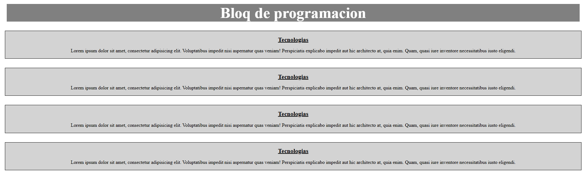

# Lorem Cards

> Proyecto de iniciación a HTML y CSS · WorldSkills 2025  
> Primer trimestre ADSO

## Contexto WorldSkills

Este fue mi **primer contacto real** con el maquetado web. Recuerdo que el instructor escribía cada etiqueta y atributo CSS explicando en voz alta el porqué de cada decisión. Ver su soltura me inspiró a imitarlo. El ejercicio consistía en replicar unas tarjetas con texto de relleno (Lorem ipsum) para practicar estructura y estilos básicos.

## Tecnologías utilizadas

- **HTML5** (etiquetas semánticas básicas)
- **CSS3** (colores, bordes, sombras, fuentes)

## Aprendizajes clave

- Estructurar un documento HTML con `div`, `h1`, `p`.
- Aplicar estilos con selectores de clase y etiqueta.
- Comprender el modelo de caja (margin, padding, border).
- Primera vez que veía un resultado visual inmediato y me generaba asombro.

## Captura

---

*Proyecto realizado en julio de 2025 durante la preparación para WorldSkills.*