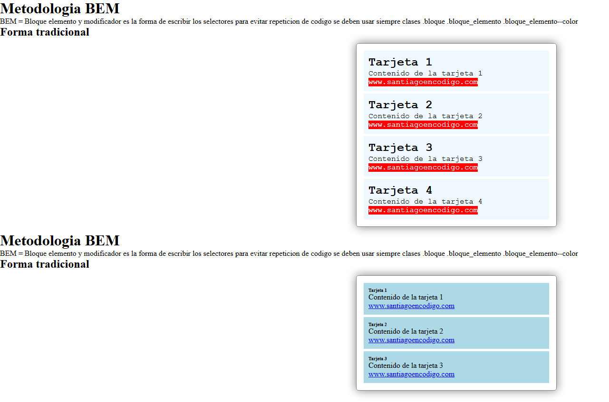

# Metodología BEM

> Aplicación de la convención BEM (Bloque, Elemento, Modificador) · WorldSkills 2025

## Contexto WorldSkills

Uno de mis mayores problemas al empezar era **nombrar las clases CSS**. Siempre me preguntaba "¿qué nombre le pongo?". El instructor nos enseñó la metodología **BEM**, que ordenó completamente mi forma de escribir HTML y CSS. Este proyecto consiste en tres tarjetas estilizadas siguiendo estrictamente BEM.

## Tecnologías utilizadas

- HTML5
- CSS3 (clases BEM)

## Aprendizajes clave

- Comprender la estructura `.bloque__elemento--modificador`.
- Evitar la repetición de código y la especificidad excesiva.
- Leer y mantener código de forma más profesional.
- Dejé de usar `id` para estilos y empecé a usar clases descriptivas.

## Captura

---

*"BEM cambió mi vida como maquetador."*