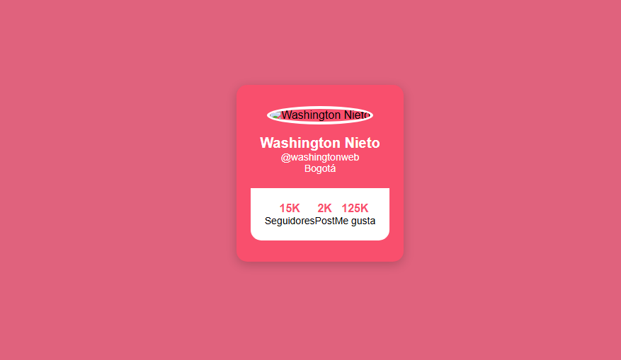

# Social Cards – Tarea Washington

> Tarjeta de perfil inspirada en el instructor Washington Nieto · WorldSkills 2025

## Contexto WorldSkills

Esta fue una **tarea autónoma**: debíamos replicar una tarjeta similar a la que el instructor había mostrado, pero sin su guía paso a paso. El objetivo era practicar la ubicación de elementos y tomar decisiones de diseño por nosotros mismos. Fue mi primer ejercicio "sin rueditas".

## Tecnologías utilizadas

- HTML5
- CSS3 (Flexbox básico)

## Aprendizajes clave

- Aprender a **medir y posicionar** elementos sin depender de un tutorial.
- Usar `display: flex` para alinear horizontalmente las estadísticas.
- Manejar la sensación de "no saber por dónde empezar" y superarla.
- Ganar confianza para encarar proyectos propios.

## Captura

---

*"Hacerlo solo fue el verdadero aprendizaje."*