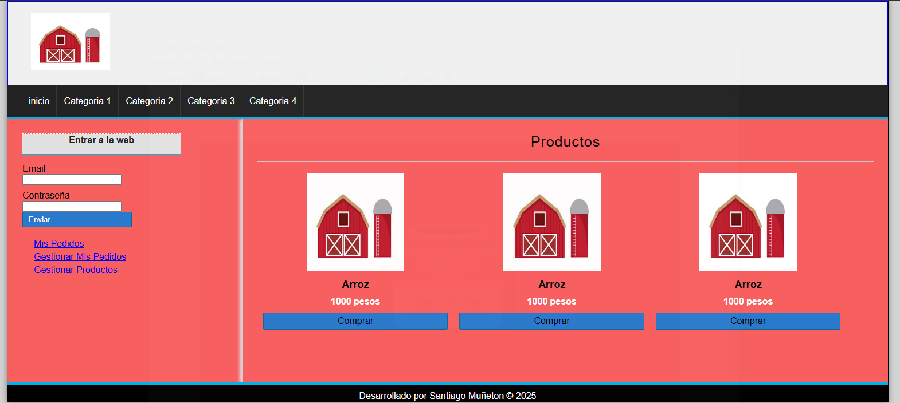

# Granero – Maquetación de ecommerce básico

> Primer acercamiento a una interfaz de tienda virtual · WorldSkills 2025

## Contexto WorldSkills

La idea era entender cómo se estructuran las páginas de **ecommerce**: productos, precios, botones de compra, y además un área de login y gestión de pedidos. Fue muy rudimentario (todo en una sola página), pero me ayudó a visualizar la complejidad de un sitio real.

## Tecnologías utilizadas

- HTML5
- CSS3

## Aprendizajes clave

- Organizar secciones: catálogo, formularios, pie de página.
- Usar listas o `div` para mostrar productos repetitivos.
- Comprender que un ecommerce requiere mucho más que HTML/CSS (backend, BD).
- Primer contacto con la idea de "gestión de productos".

## Captura

---

*"Un vistazo a lo que sería construir una tienda online."*