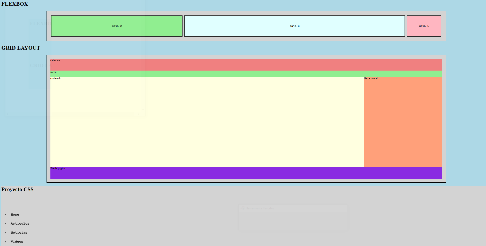

# CSS Grid + Flexbox + Animaciones

> Laboratorio de layouts modernos y microinteracciones · WorldSkills 2025

## Contexto WorldSkills

Este proyecto fue **pura exploración técnica**: aprendí a usar **CSS Grid** y **Flexbox** para crear layouts complejos, y además experimenté con **animaciones CSS** (transiciones, keyframes). Recuerdo mi asombro al ver cómo los elementos se movían solos con solo unas líneas de CSS.

## Tecnologías utilizadas

- HTML5
- CSS3 (Grid, Flexbox, `@keyframes`, `transition`)

## Aprendizajes clave

- Diferencias entre Grid (bidimensional) y Flexbox (unidimensional).
- Crear layouts responsivos sin `float` ni tablas.
- Animar elementos con `transform` y `transition`.
- Entender que el CSS puede dar vida a una página sin JavaScript.

## Captura

---

*"Descubrí que CSS no es solo colores, es movimiento y estructura."*