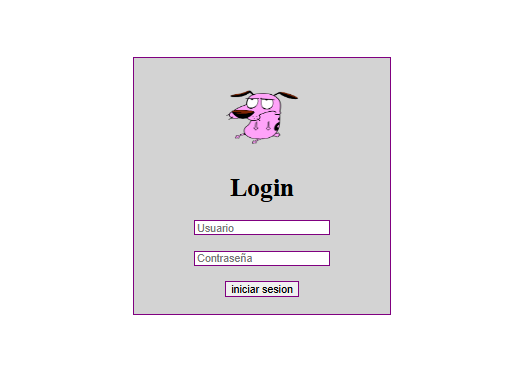

# Login con PHP

> Primer contacto con PHP como antesala a Laravel · WorldSkills 2025

## Contexto WorldSkills

Antes de lanzarnos a Laravel, el instructor nos mostró **PHP puro** para entender cómo se procesan los formularios en el servidor. Este login básico (usuario y contraseña) fue mi primera vez escribiendo código del lado del servidor. Me costó entender la diferencia entre cliente y servidor, pero fue un paso necesario.

## Tecnologías utilizadas

- HTML5
- CSS3
- PHP (procesamiento de formularios)

## Aprendizajes clave

- Crear un formulario con método `POST`.
- Recibir datos en PHP con `$_POST`.
- Validaciones simples (campos no vacíos).
- Redireccionamiento y gestión de sesiones básica (no implementada).

## Captura

## 🔗 Cómo verlo

Requiere un servidor con PHP (XAMPP, WAMP). Colocar en `htdocs` y acceder vía `http://localhost/...`.

---

*"Mi puerta de entrada al backend."*