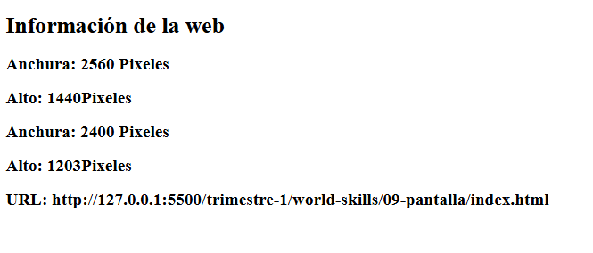

# Pantalla – Información de resolución y URL

> Proyecto para entender funcionalidades de JavaScript · WorldSkills 2025

## Contexto WorldSkills

El objetivo era usar JavaScript para **obtener datos del navegador** (ancho, alto de la ventana, URL actual) y mostrarlos en pantalla. Me ayudó a entender que JS puede acceder a información del entorno de ejecución.

## Tecnologías utilizadas

- HTML5
- CSS3
- JavaScript (objetos `window`, `screen`, `location`)

## Aprendizajes clave

- Usar `window.innerWidth`, `window.innerHeight`.
- Usar `screen.width`, `screen.height`.
- Leer la URL actual con `window.location.href`.
- Actualizar el DOM con esos valores dinámicamente.

## Captura

---

*"JS no solo manipula el DOM, también lee el entorno."*