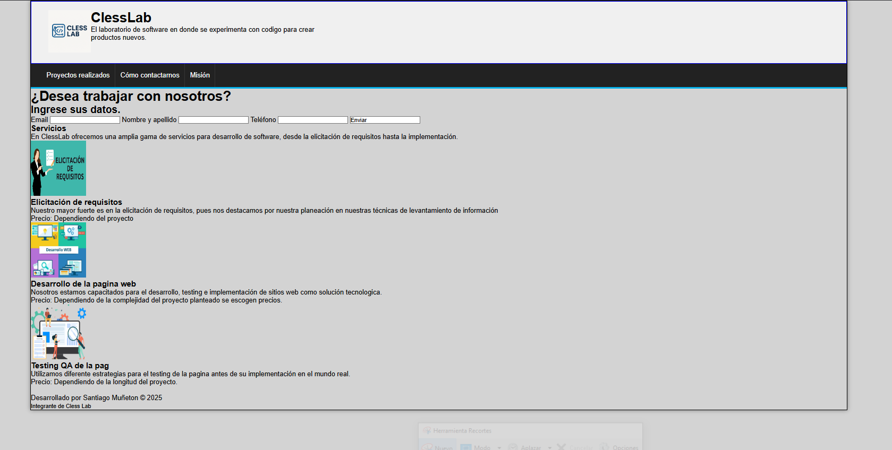

# ClessLab – Mi primera página web completa (solo HTML/CSS)

> Proyecto personal inspirado en los temas del tecnólogo · WorldSkills 2025

## Contexto WorldSkills

Esta fue **mi primera página web hecha completamente por mí solo**, sin seguir un tutorial paso a paso. Me costó bastante, pero tomé como referencia lo que estábamos viendo en el tecnologo. Hoy, al ver la captura, me siento como un niño aprendiendo, pero me llena de orgullo porque fue mi punto de partida real.

## Tecnologías utilizadas

- HTML5 (estructura de servicios, formularios)
- CSS3 (estilos, disposición)

## Aprendizajes clave

- Organizar una página en secciones (header, servicios, formulario, footer).
- Crear un formulario de contacto con varios campos.
- Usar listas para describir servicios y precios.
- Aplicar estilos consistentes en toda la página.

## Captura

---

*"Mi primera creación original. La recuerdo con cariño."*