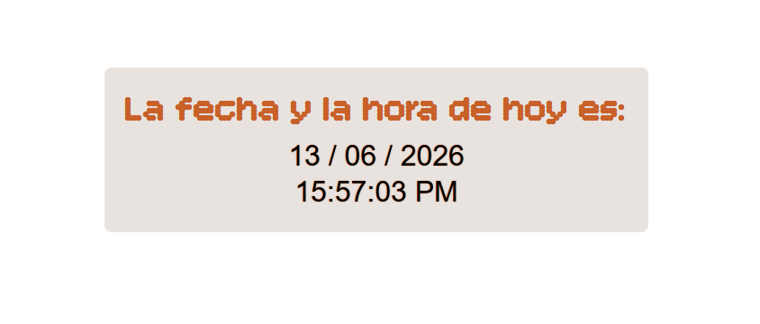

# Fecha y Hora

> Reloj y calendario dinámico con JavaScript · WorldSkills 2025

## Contexto WorldSkills

Continuando con la exploración de JavaScript, este proyecto muestra la **fecha y hora actuales** en tiempo real. Aprendí a usar el objeto `Date` y a actualizar el DOM automáticamente.

## Tecnologías utilizadas

- HTML5
- CSS3
- JavaScript (objeto `Date`, `setInterval`)

## Aprendizajes clave

- Obtener día, mes, año, hora, minutos, segundos con `Date`.
- Formatear la salida (agregar ceros a la izquierda, AM/PM).
- Usar `setInterval` para actualizar cada segundo.
- Insertar texto dinámico en elementos HTML.

## Captura

---

*"El tiempo es dinámico, y JS puede seguirlo."*