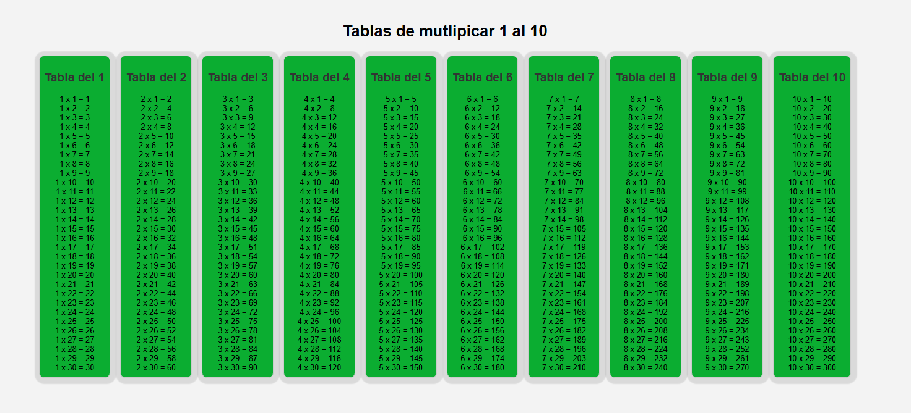

# Tablas de Multiplicar

> Generador dinámico de tablas del 1 al 30 · WorldSkills 2025

## Contexto WorldSkills

Proyecto muy importante para entender **bucles** y **renderizado dinámico con JavaScript**. En lugar de escribir 30 filas a mano, usé un `for` para generar la tabla entera. Fue un cambio de paradigma: el código escribe código.

## Tecnologías utilizadas

- HTML5
- CSS3 (tabla estilizada)
- JavaScript (bucles `for`, creación de elementos HTML)

## Aprendizajes clave

- Usar `for` anidados para generar filas y columnas.
- Insertar HTML dinámico con `innerHTML` o `createElement`.
- Comprender que el DOM se puede construir completamente desde JS.
- Manejar grandes cantidades de datos de forma automática.

## Captura

---

*"Los bucles me ahorraron horas de trabajo manual."*