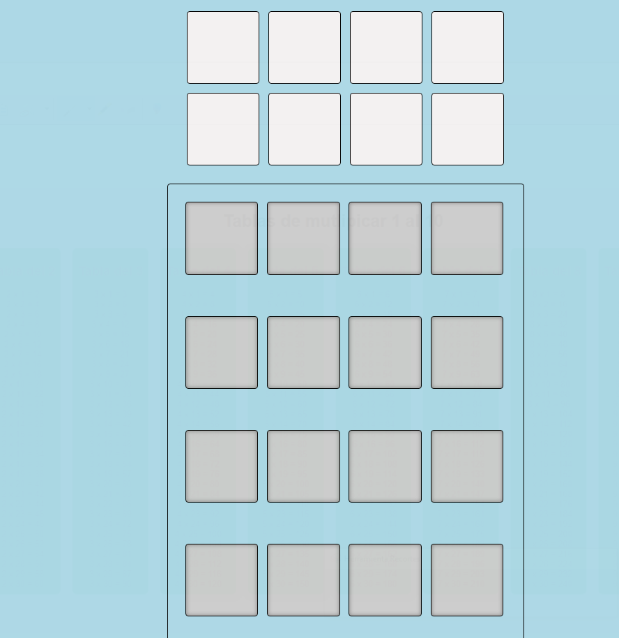

# Almacén de Cajas (Drag & Drop)

> Interfaz de arrastrar y soltar · WorldSkills 2025 (actividad de competencia)

## Contexto WorldSkills

Este ejercicio también **apareció en la competencia**. Aprendí a implementar **drag & drop** nativo con JavaScript. Fue un reto porque involucraba eventos del mouse y manipulación dinámica de elementos. Muy satisfactorio cuando logré que las cajas se movieran entre contenedores.

## Tecnologías utilizadas

- HTML5
- CSS3
- JavaScript (eventos `dragstart`, `dragend`, `dragover`, `drop`)

## Aprendizajes clave

- Comprender el ciclo de eventos del drag & drop.
- Usar `setData` y `getData` para transferir información.
- Prevenir comportamientos por defecto (`preventDefault`).
- Cambiar estilos visuales durante el arrastre.

## Captura

## 🔗 Cómo verlo

Abre `index.html`. Arrastra las cajas de un lado a otro.

---

*"El drag & drop me hizo sentir que hacía magia."*