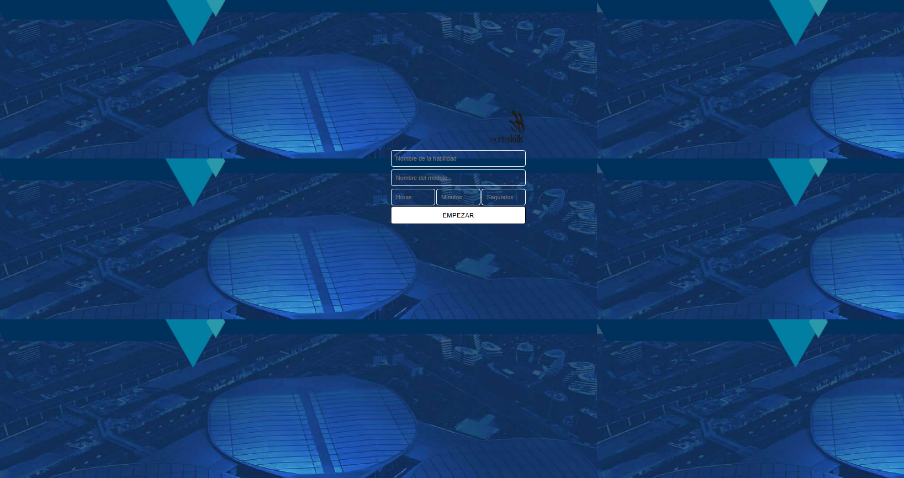

#  Cronómetro WorldSkills

> Cronómetro interactivo con PHP y JavaScript · WorldSkills 2025

## Contexto WorldSkills

Este cronómetro permite al usuario ingresar horas, minutos y segundos, y luego iniciar una cuenta regresiva. La peculiaridad: **requiere XAMPP** (o cualquier servidor con PHP) porque los datos se envían al servidor para procesar la cuenta. Me ayudó a entender la integración entre frontend y backend.

## Tecnologías utilizadas

- HTML5
- CSS3
- JavaScript (temporizadores)
- PHP (procesamiento del formulario)

## Aprendizajes clave

- Recibir datos de un formulario y enviarlos a PHP.
- Usar `setInterval` para actualizar la cuenta regresiva en el cliente.
- Manejar la comunicación asíncrona (aunque sin AJAX puro).
- Validar tiempos y mostrar mensajes de error.

## Captura

## 🔗 Cómo verlo

Ejecutar con XAMPP (Apache). Colocar la carpeta en `htdocs` y acceder vía `http://localhost/...`.

---

*"El primer proyecto que combinó PHP, JS y HTML."*