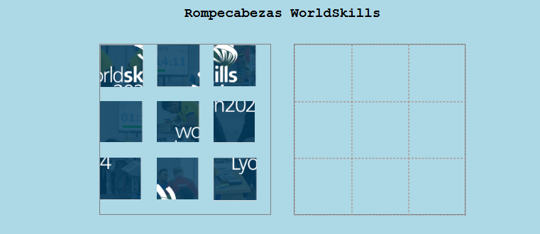

# Rompecabezas WorldSkills Módulo A

> Puzzle con imágenes de WorldSkills usando Drag & Drop · WorldSkills 2025 (actividad de competencia)

## Contexto WorldSkills

Este proyecto fue **muy satisfactorio** porque apliqué drag & drop a una aplicación real (un rompecabezas con imágenes de WorldSkills). Aunque me costó entenderlo inicialmente, ver las piezas moverse y encajar fue una gran motivación. También apareció en la competencia.

## Tecnologías utilizadas

- HTML5
- CSS3 (Grid para las piezas)
- JavaScript (drag & drop, lógica de ordenamiento)

## Aprendizajes clave

- Organizar un conjunto de elementos arrastrables en una cuadrícula.
- Validar si la pieza se coloca en la posición correcta.
- Reordenar elementos visualmente con JavaScript.
- Usar imágenes locales y manipular su posición.

## Captura

## Cómo verlo

Abre `index.html`. Arrastra las piezas para resolver el puzzle.

---

*"El drag & drop aplicado a un juego real."*