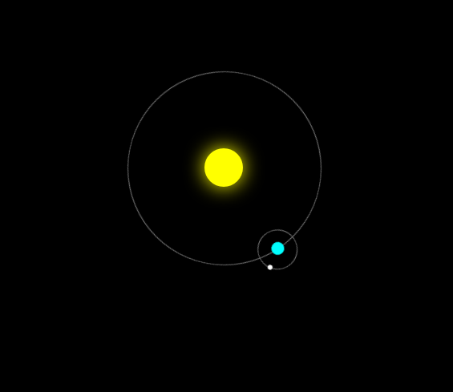

# Órbita Celestial

> Sistema planetario animado con HTML y CSS puro · WorldSkills 2025 (actividad de competencia)

## Contexto WorldSkills

Este proyecto apareció en la competencia y consistía en crear una **órbita planetaria usando exclusivamente HTML y CSS** (sin JavaScript). El HTML solo contiene `div` con clases, y el CSS se encarga de las animaciones, transformaciones y posicionamiento. Fue una lección de creatividad y dominio de CSS.

## Tecnologías utilizadas

- HTML5 (solo `div` anidados)
- CSS3 (`@keyframes`, `transform: rotate`, `border-radius`, posicionamiento absoluto)

## Aprendizajes clave

- Crear formas circulares con `border-radius: 50%`.
- Usar `position: absolute` y `relative` para anidar órbitas.
- Animar rotaciones continuas con `animation: rotate infinite linear`.
- Comprender que CSS puede generar experiencias visuales complejas sin JS.

## Captura

## Cómo verlo

Abre `index.html`. Verás los planetas girando.

---

*"CSS puro puede crear universos."*