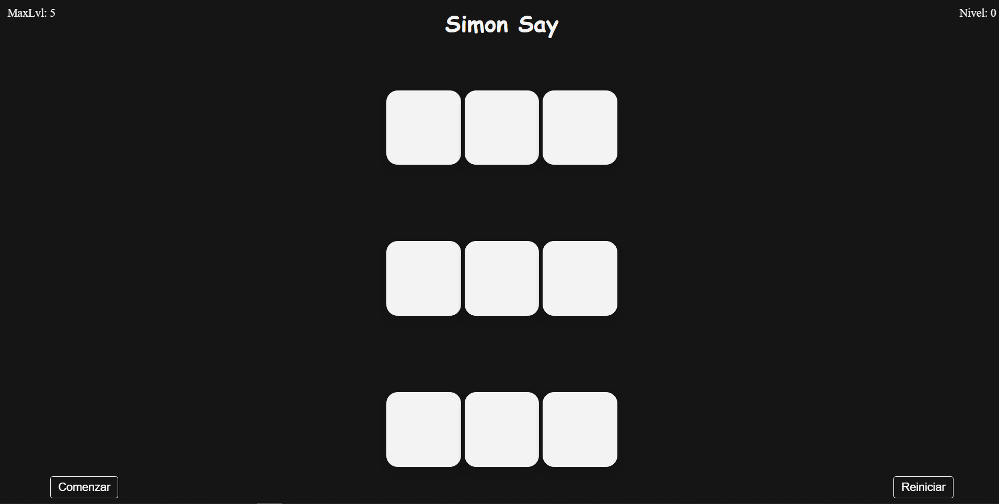

# Simon Say – Juego de memoria

> Versión personal del clásico juego de memoria · WorldSkills 2025

## Contexto WorldSkills

Seguimos un tutorial de YouTube para construir este juego. Había múltiples versiones entre compañeros y el instructor; esta es **mi versión** basada en el tutorial. Aprendí cómo se estructura un proyecto interactivo completo: HTML, CSS y JavaScript trabajando juntos.

## Tecnologías utilizadas

- HTML5
- CSS3 (animaciones, colores)
- JavaScript (secuencias, eventos, temporizadores)

## Aprendizajes clave

- Manejar arrays para almacenar secuencias.
- Usar `setTimeout` para reproducir la secuencia paso a paso.
- Detectar clics del usuario y comparar con la secuencia esperada.
- Gestionar niveles y puntuación máxima.
- Reiniciar el juego sin recargar la página.

## Captura

## Cómo verlo

Abre `index.html`. Presiona "Comenzar" y repite la secuencia.

---

*"Mi primer juego completo con lógica de estados."*