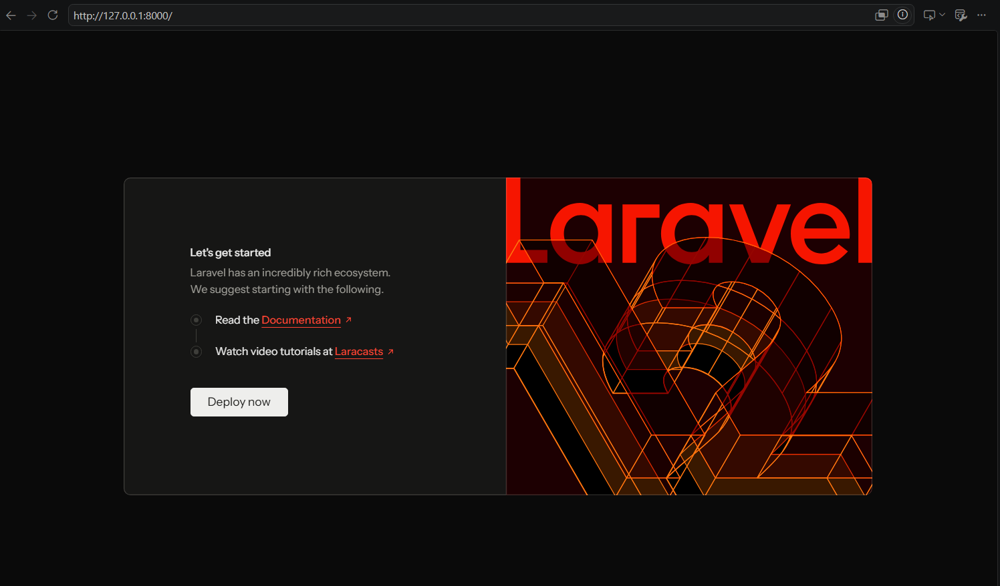
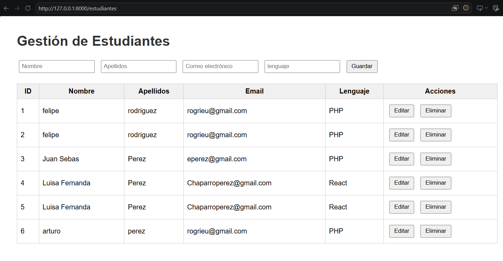

# Laravel – Gestión de Estudiantes

> Proyecto backend completo desarrollado durante las **WorldSkills 2025** (julio 2025)  
> Primer trimestre ADSO · Etapa final antes de la competencia distrital

---

## Contexto WorldSkills

Durante mi participación en **WorldSkills 2025** fui seleccionado junto a otras **12 personas en Bogotá** (de todos los centros de formación SENA que tenian programas de formación tecnológica en Análisis y Desarrollo de Software (ADSO)) para representar a mi centro en la disciplina de desarrollo de software especificamente en Tecnologias Web. Aunque no logré pasar a la fase regional, **fue una experiencia transformadora**: por primera vez tuve que integrar frontend, backend y base de datos en una misma aplicación.

Laravel fue la tecnología elegida para el backend. Este proyecto es **el más completo de los 4 que intenté** durante esas semanas. Los otros estaban incompletos o solo exploraban la instalación. Aquí, en cambio, pude **entender y aplicar el patrón MVC (Modelo-Vista-Controlador)** de principio a fin, conectarme a una base de datos SQLite y construir una API REST funcional.

> **Fechas clave**  
> - Julio 2025 – Creación del proyecto durante las World Skills  
> - 13/06/2026 – Documentación y puesta a punto del repositorio  
> - Instructor: [Washington Nieto](https://github.com/WashingtonNieto)

---

## Propósito de aprendizaje

- **Entender el flujo completo** de una aplicación web con Laravel (rutas → controlador → modelo → vista).
- **Diseñar una API REST** para operaciones CRUD (Crear, Leer, Actualizar, Eliminar).
- **Validar datos** del lado del servidor antes de guardarlos.
- **Conectar y migrar una base de datos** (SQLite) usando migraciones de Laravel.
- **Consumir la API desde el frontend** con JavaScript nativo (Fetch API) y renderizar dinámicamente.
- **Resolver problemas reales** de configuración y caché al mover un proyecto entre directorios (lección valiosísima).

---

## Tecnologías utilizadas

| Capa          | Tecnología                               |
|---------------|------------------------------------------|
| Backend       | Laravel 11 (PHP)                         |
| Base de datos | SQLite (archivo `database.sqlite`)       |
| Frontend      | HTML5, CSS3, JavaScript (Fetch API)      |
| Servidor local| `php artisan serve`                      |

---

## Estructura del proyecto (relevante)

```
20-laravel/
├── app/
│   ├── Http/
│   │   └── Controllers/
│   │       └── EstudianteController.php   ← Lógica CRUD
│   └── Models/
│       └── Estudiante.php                 ← Modelo Eloquent
├── database/
│   ├── migrations/
│   │   └── ..._create_estudiantes_table.php
│   └── database.sqlite                    ← Base de datos
├── routes/
│   ├── web.php                            ← Rutas de vistas
│   └── api.php                            ← Rutas de la API
├── resources/views/
│   ├── welcome.blade.php                  ← Página de bienvenida
│   └── estudiantes.blade.php              ← Interfaz CRUD
└── .env                                   ← Configuración (DB, APP_KEY)
```

---

## Funcionalidades del proyecto

Este es un **ABM (Alta-Baja-Modificación)** de estudiantes con los siguientes atributos:

- `nombre`
- `apellidos`
- `email`
- `lenguaje` (solo se acepta Java, PHP o React)

### Operaciones disponibles

| Método HTTP | Endpoint                  | Descripción                     |
|-------------|---------------------------|---------------------------------|
| GET         | `/api/estudiantes`        | Obtener todos los estudiantes   |
| GET         | `/api/estudiantes/{id}`   | Obtener un estudiante           |
| POST        | `/api/estudiantes`        | Crear nuevo estudiante          |
| PUT         | `/api/estudiantes/{id}`   | Actualizar completo             |
| PATCH       | `/api/estudiantes/{id}`   | Actualización parcial           |
| DELETE      | `/api/estudiantes/{id}`   | Eliminar estudiante             |

La interfaz web (`/estudiantes`) consume estos endpoints mediante JavaScript y muestra los datos en una tabla interactiva.

---

## Cómo ejecutar el proyecto (después de moverlo de carpeta)

Si clonas o mueves este proyecto a otra ubicación, **puede aparecer el error**:

```
View [welcome] not found
```

Esto ocurre porque Laravel guarda rutas absolutas en su caché. Para solucionarlo, sigue estos pasos (documentados durante mi aprendizaje):

```bash
# 1. Limpiar toda la caché de Laravel (config, rutas, vistas, eventos)
php artisan optimize:clear

# 2. Regenerar el autoload de Composer (actualiza rutas absolutas)
composer dump-autoload

# 3. (Opcional) Borrar manualmente bootstrap/cache/* en Windows PowerShell:
# Personalmente, no lo ejecute.
Remove-Item -Path bootstrap\cache\* -Exclude .gitignore -Force

# 4. Regenerar la clave de la aplicación
php artisan key:generate

# 5. Refrescar configuración y rutas
php artisan config:cache
php artisan route:cache
```

Después de estos comandos, el servidor funciona correctamente:

```bash
php artisan serve
```

Accede a:
- `http://127.0.0.1:8000/` → Página de bienvenida de Laravel
- `http://127.0.0.1:8000/estudiantes` → Aplicación de gestión de estudiantes

> 📸 *Captura de la página de bienvenida y de la tabla de estudiantes se encuentran en `./assets/welcome.png` (y otra similar).*

---

## Reflexión personal (¿por qué este proyecto es importante?)

**Antes de Laravel**, solo había hecho frontend estático con HTML, CSS y algo de JavaScript. **Laravel fue mi primer contacto real con un framework backend profesional**. Aunque al principio fue muy complicado y muchas cosas no las entendía (middlewares, ORM, service container), este proyecto logró encapsular el ciclo completo:

1. El usuario ve una interfaz.
2. Interactúa (guarda, edita, elimina).
3. JavaScript llama a la API.
4. Laravel valida, procesa y responde.
5. La vista se actualiza dinámicamente.

Ver los datos fluir desde la base de datos hasta la pantalla, y viceversa, fue **un momento de quiebre en mi formación**. Entendí que el desarrollo web no es solo diseño visual, sino **arquitectura, lógica y persistencia**.

Este proyecto, aunque básico, es la semilla de todo lo que vendría después: APIs más complejas, autenticación, relaciones entre tablas, y despliegues en la nube.

> Aunque inicialmente, cuando inicie... Realmente no entendia totalmente la funcionalidad de esto respecto a la interacción del proyecto con una Base de Datos. Ni entendia el tema de rutas, del controlador, de las views y demás. 
>
> Fueron recuerdos muy bonitos.

---

## Resultados en capturas

> Al ejecutar el servidor.



> Al agregar /estudiantes en la ruta del servidor.



---

## Agradecimientos

Al instructor [Washington Nieto](https://github.com/WashingtonNieto "https://github.com/WashingtonNieto") por guiarnos en las WorldSkills.

Y a mi compañero [Cristian David Motta](https://github.com/Cristianmotta "https://github.com/Cristianmotta"), por haberme dado la iniciativa a ingresar a las World Skills.

---

## 📄 Licencia

Proyecto académico, sin fines comerciales. Parte del portafolio de aprendizaje ADSO.
