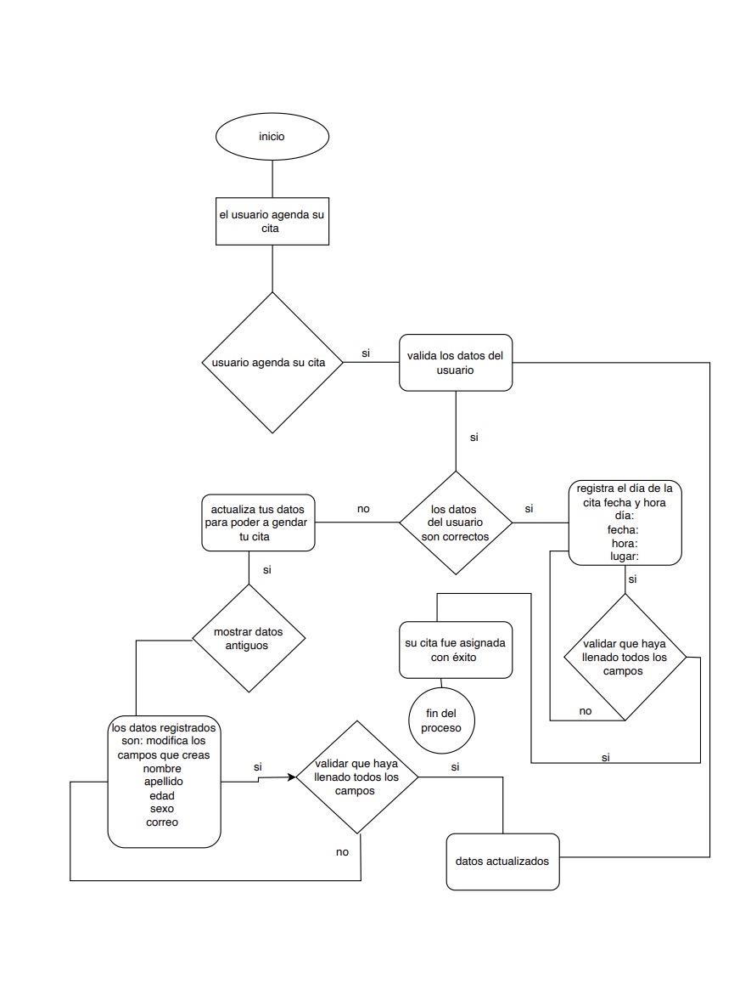
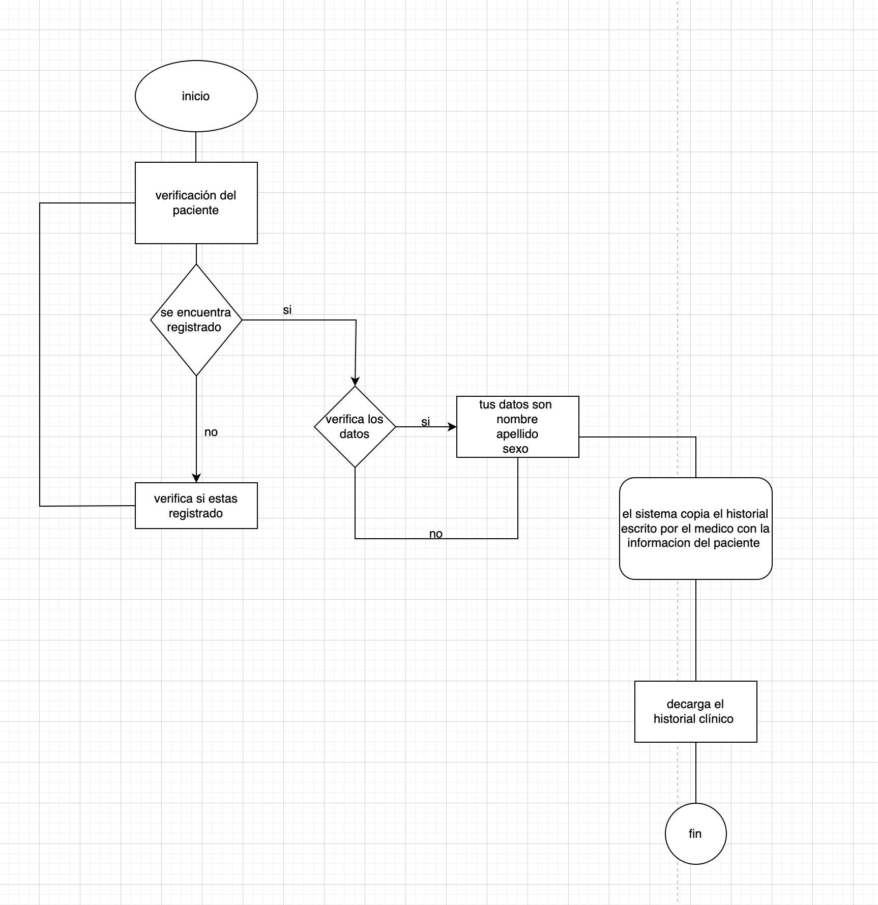

# Modelado de funciones – Introducción y caso práctico

> El modelado de funciones es una actividad clave en el análisis de software que consiste en representar gráficamente las funciones que un sistema debe realizar, así como las interacciones entre los actores y el sistema. A través de diagramas como los casos de uso, se logra una comprensión compartida entre el equipo de desarrollo y los stakeholders.

---

## Tabla de contenido

- [1. Introducción al modelado de funciones](#1-introducción-al-modelado-de-funciones)
- [2. Caso práctico: Clínica Dental Sonrisa Perfecta](#2-caso-práctico-clínica-dental-sonrisa-perfecta)
  - [2.1 Problema identificado](#21-problema-identificado)
  - [2.2 Requerimientos funcionales](#22-requerimientos-funcionales)
  - [2.3 Requerimientos no funcionales](#23-requerimientos-no-funcionales)
  - [2.4 Reglas de negocio](#24-reglas-de-negocio)
  - [2.5 Criterios de aceptación](#25-criterios-de-aceptación)
  - [2.6 Diagramas de casos de uso](#26-diagramas-de-casos-de-uso)
- [3. Reflexión sobre el taller](#3-reflexión-sobre-el-taller)

---

## 1. Introducción al modelado de funciones

El **modelado de funciones** es el proceso de identificar, documentar y representar las funciones que un sistema de software debe ofrecer para satisfacer las necesidades de los usuarios y del negocio. Su objetivo es transformar los requisitos (funcionales y no funcionales) en una representación visual que facilite:

- La comunicación entre analistas, desarrolladores y clientes.
- La validación temprana de los requisitos.
- La identificación de actores, procesos y flujos de información.
- La base para el diseño detallado y la implementación.

Uno de los artefactos más utilizados en el modelado de funciones es el **diagrama de casos de uso**, que muestra los actores (usuarios o sistemas externos) y los casos de uso (funcionalidades) que el sistema debe proporcionar. A continuación, se presenta un caso práctico que ilustra la aplicación de estos conceptos.

---

## 2. Caso práctico: Clínica Dental Sonrisa Perfecta

### 2.1 Problema identificado

La clínica dental **Sonrisa Perfecta** es una pequeña empresa que actualmente maneja su gestión mediante una **agenda manual en papel**. Esto ha generado múltiples problemas:

- **Pérdida de información** y registros importantes.
- **Confusiones en los horarios**, lo que ocasiona:
  - Pérdida de citas.
  - Largos tiempos de espera para los pacientes.
- **Dificultad para hacer seguimiento** de los historiales clínicos de los pacientes.
- **Ineficiencia operativa** que afecta la experiencia del paciente y la productividad del personal.

Por esta razón, se ha propuesto desarrollar un sistema de información que automatice la gestión de citas y el historial clínico de los pacientes, mejorando la eficiencia y la calidad del servicio.

---

### 2.2 Requerimientos funcionales

Los requerimientos funcionales (RF) definen **qué** debe hacer el sistema. Para este caso, se han identificado los siguientes:

| **ID** | **Nombre** | **Descripción** |
|--------|------------|-----------------|
| **RF-001** | Registro y consulta de citas e historial médico | El sistema debe permitir a los pacientes autenticarse mediante login, registrarse, visualizar sus citas y consultar su historial clínico. |
| **RF-002** | Agendamiento de citas | El paciente puede agendar citas seleccionando fecha, día, hora y especialidad, validando la disponibilidad del profesional. |
| **RF-003** | Consulta y reprogramación de citas | El paciente puede consultar citas disponibles y reagendar una cita previamente asignada con la debida anticipación. |
| **RF-004** | Cancelación y modificación de citas | El paciente puede cancelar o modificar una cita vigente, siempre que no haya sido atendida. |
| **RF-005** | Almacenamiento de historiales clínicos | El sistema almacena diagnósticos, tratamientos, observaciones y documentos médicos de cada paciente. |
| **RF-006** | Registro de observaciones odontológicas | El odontólogo registra observaciones del estado de salud dental del paciente durante la consulta. |
| **RF-007** | Acceso al historial médico por personal autorizado | Odontólogos y personal autorizado pueden consultar el historial completo del paciente con auditoría de accesos. |

#### Descripción detallada de cada requerimiento funcional

**RF-001: Registro y Consulta de Citas e Historial Médico**

El sistema debe permitir a los pacientes autenticarse mediante un módulo de login seguro. Una vez autenticados, los pacientes podrán:
- Registrarse en el sistema mediante un formulario con sus datos personales.
- Visualizar un listado actualizado de sus citas médicas asignadas.
- Consultar su historial clínico almacenado en el sistema.

**Criterios de Aceptación:**
- El login debe requerir mínimo correo electrónico y contraseña.
- El paciente solo podrá visualizar información correspondiente a su perfil.
- El historial médico debe mostrarse de forma organizada por fecha y tipo de atención.

---

**RF-002: Agendamiento de Citas por el Paciente**

El sistema debe permitir a los pacientes agendar sus citas médicas de manera autónoma a través de la plataforma. Para ello, el sistema ofrecerá una interfaz donde el paciente podrá seleccionar:
- Fecha disponible.
- Día de la semana.
- Hora de atención.
- Especialidad o tipo de consulta (si aplica).

El sistema deberá validar la disponibilidad del profesional de salud antes de confirmar la cita.

**Criterios de Aceptación:**
- El paciente debe poder visualizar un calendario con horarios disponibles.
- No se deben permitir citas duplicadas o fuera del horario laboral definido.
- Al confirmar la cita, el sistema debe enviar una notificación al paciente (vía correo o mensaje interno).
- La cita debe quedar registrada en el historial del paciente.

---

**RF-003: Consulta y Reprogramación de Citas**

El sistema debe permitir a los pacientes consultar el listado de citas disponibles con el fin de reagendar una cita previamente asignada. El paciente podrá seleccionar una nueva fecha y hora dentro de los horarios habilitados, siempre que lo haga con la debida anticipación establecida por las reglas del sistema.

**Criterios de Aceptación:**
- El sistema debe mostrar un calendario con las citas disponibles por especialidad y profesional.
- Solo se permitirá el reagendamiento de citas que aún no hayan sido atendidas ni canceladas.
- Al confirmar el cambio, la nueva cita debe reemplazar a la anterior en el historial del paciente.
- El paciente debe recibir una notificación de la nueva programación.

---

**RF-004: Cancelación y Modificación de Citas**

El sistema debe permitir al paciente cancelar o modificar una cita médica previamente agendada. Para la modificación, el paciente podrá seleccionar una nueva fecha y hora dentro de la disponibilidad del calendario. La cancelación eliminará la cita del cronograma y del historial de citas activas del paciente.

**Criterios de Aceptación:**
- Solo se podrán cancelar o modificar citas vigentes (no expiradas ni atendidas).
- El sistema debe requerir confirmación del paciente antes de completar la cancelación o modificación.
- El paciente debe recibir una notificación con el resultado de la acción (cancelación o nueva cita agendada).
- Las modificaciones deben actualizar automáticamente el cronograma del profesional asignado.

---

**RF-005: Almacenamiento de Historiales Clínicos**

El sistema debe permitir almacenar de forma segura y organizada los historiales clínicos de cada paciente. Esta información incluirá diagnósticos, tratamientos, observaciones médicas, antecedentes y cualquier otro dato relevante generado durante las consultas.

**Criterios de Aceptación:**
- Cada historial clínico debe estar asociado a un paciente registrado en el sistema.
- Los datos deben almacenarse con mecanismos de integridad y protección de la información (según normativas de confidencialidad).
- El historial debe poder consultarse cronológicamente por el personal autorizado y por el propio paciente (modo lectura).
- El sistema debe permitir adjuntar documentos médicos (imágenes, exámenes, prescripciones).

---

**RF-006: Registro de Observaciones Odontológicas**

El sistema debe permitir al odontólogo registrar observaciones clínicas relacionadas con el estado de salud dental del paciente durante la consulta. Estas observaciones formarán parte del historial clínico del paciente y deberán incluir detalles como diagnósticos, condiciones bucales, tratamientos recomendados y notas adicionales.

**Criterios de Aceptación:**
- Solo los odontólogos autenticados podrán acceder a esta funcionalidad.
- Las observaciones deben quedar asociadas a la cita correspondiente y al historial del paciente.
- El sistema debe permitir el uso de campos estructurados (selección de condiciones comunes) y un campo de texto libre para anotaciones específicas.
- Las observaciones deben ser inalterables una vez guardadas, salvo por usuarios con permisos especiales (según reglas de negocio).

---

**RF-007: Acceso al Historial Médico por Personal Autorizado**

El sistema debe permitir que el odontólogo y demás usuarios autorizados (como personal administrativo o asistencial con permisos definidos) puedan consultar el historial médico completo del paciente. Esta funcionalidad debe garantizar la confidencialidad, integridad y trazabilidad del acceso a los datos clínicos.

**Criterios de Aceptación:**
- Solo usuarios autenticados con permisos específicos podrán acceder a los historiales médicos.
- El historial debe mostrarse de forma organizada y cronológica, incluyendo citas, diagnósticos, tratamientos y observaciones.
- El sistema debe registrar en un log cada vez que un historial clínico es accedido (auditoría).
- No se permitirá la edición del historial salvo por personal con permisos especiales según reglas de negocio.

---

### 2.3 Requerimientos no funcionales

Los requerimientos no funcionales definen **cómo** debe comportarse el sistema:

| **ID** | **Nombre** | **Descripción** |
|--------|------------|-----------------|
| **RNF-001** | Interfaz amigable | La interfaz debe ser intuitiva y fácil de usar para pacientes y personal de la clínica. |
| **RNF-002** | Disponibilidad | El sistema debe estar operativo el 99% del tiempo, garantizando acceso continuo. |
| **RNF-003** | Adaptabilidad | Debe funcionar correctamente en todos los navegadores web y dispositivos móviles (responsive). |
| **RNF-004** | Confidencialidad | El paciente debe aceptar las normas de confidencialidad de los datos médicos antes de usar el sistema. |
| **RNF-005** | Seguridad | La información del paciente debe estar protegida mediante cifrado de datos y autenticación segura (usuario y contraseña). |

---

### 2.4 Reglas de negocio

Las reglas de negocio establecen restricciones y condiciones específicas del negocio:

| **ID** | **Regla** | **Descripción** |
|--------|-----------|-----------------|
| **RN-001** | Límite de cancelaciones | El paciente puede cancelar su cita hasta **2 veces** sin penalización. A partir de la tercera cancelación, se aplicará una multa del 5% del valor de la consulta al reagendar. |
| **RN-002** | Límite de reagendamientos | El paciente puede reagendar su cita hasta **5 veces**. Si supera este límite, el sistema cancelará automáticamente la cita y se aplicará la multa correspondiente. |
| **RN-003** | Anticipación para cambios | Las cancelaciones o modificaciones deben realizarse con al menos **24 horas de anticipación** para evitar penalizaciones. |

---

### 2.5 Criterios de aceptación

Los criterios de aceptación definen las condiciones que deben cumplirse para que un requerimiento sea considerado completo:

| **ID** | **Criterio** | **Descripción** |
|--------|--------------|-----------------|
| **CA-001** | Edición y cancelación de citas | El paciente puede editar y cancelar su cita desde el calendario, y será notificado por correo electrónico. |
| **CA-002** | Registro de pacientes | El paciente puede registrarse en la página con sus datos personales para tener un registro exacto. |
| **CA-003** | Almacenamiento de historial | El sistema debe permitir que la información quede guardada en el historial médico y sea visible tanto para el paciente como para el odontólogo. |

---

### 2.6 Diagramas de casos de uso

A continuación se presentan los diagramas de casos de uso que representan las funcionalidades del sistema, organizados en dos grandes áreas: **Gestión de agenda** e **Historial del paciente**.

#### Gestión de agenda (Requerimientos de agenda)

Este diagrama muestra los casos de uso relacionados con la gestión de citas, donde el actor principal es el **Paciente**:

- Registrarse en el sistema.
- Iniciar sesión (login).
- Agendar una cita.
- Consultar citas disponibles.
- Reprogramar una cita.
- Cancelar una cita.
- Modificar una cita.

**Precondición:** El usuario debe tener una cuenta registrada en el sistema.

> **Imagen:** `./assets/sonrisa-01-caso-de-uso.png`  
> *Descripción: Diagrama de casos de uso para la gestión de agenda de la clínica dental.*

#### Historial del paciente

Este diagrama muestra los casos de uso relacionados con el historial clínico, donde los actores son el **Paciente**, el **Odontólogo** y el **Personal autorizado**:

- Consultar historial clínico (paciente y personal autorizado).
- Registrar observaciones odontológicas (odontólogo).
- Almacenar historial médico (sistema).

> **Imagen:** `./assets/sonrisa-02-caso-de-uso.png`  
> *Descripción: Diagrama de casos de uso para la gestión del historial del paciente.*

---

## 3. Reflexión sobre el taller

Este ejercicio fue desarrollado como un **taller inicial** para comprender el concepto de **modelado de funciones**. A través del caso de la clínica dental, pudimos:

- **Identificar los actores:** Paciente, odontólogo, personal administrativo y sistema.
- **Extraer requerimientos funcionales y no funcionales** a partir de un problema real.
- **Definir reglas de negocio** que condicionan el comportamiento del sistema.
- **Establecer criterios de aceptación** que permiten validar cada funcionalidad.
- **Representar gráficamente** las funcionalidades mediante diagramas de casos de uso.

El modelado de funciones no solo ayuda a visualizar el sistema, sino que también permite:

- Validar que los requisitos sean completos y coherentes.
- Establecer una base sólida para el diseño detallado y la implementación.
- Facilitar la comunicación entre el equipo de desarrollo y los stakeholders.
- Identificar posibles conflictos o ambigüedades antes de comenzar la codificación.

Este taller demuestra que antes de escribir una línea de código, es fundamental comprender el problema, los actores y las funciones que el sistema debe cumplir. La documentación adecuada y el modelado visual son herramientas clave para garantizar el éxito del proyecto.

---

> Gracias por leer.