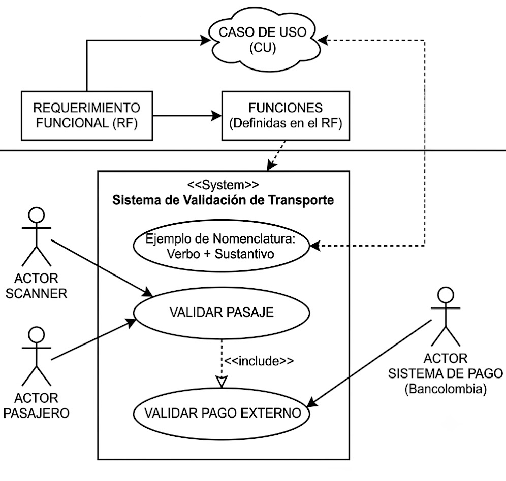

# Verificación de modelos en el análisis de software

> **Resultado de Aprendizaje (RA04):** Verificar los modelos realizados en la fase de análisis de acuerdo con lo establecido en el informe de requisitos.  
> **Competencia:** Análisis de la especificación de requisitos de software.



*Imagen generada con Gemini - AI*

---

## Tabla de contenido

- [1. Introducción: El mercado y los ingenieros de requisitos](#1-introducción-el-mercado-y-los-ingenieros-de-requisitos)
- [2. Reglas de negocio](#2-reglas-de-negocio)
  - [2.1 Definición y propósito](#21-definición-y-propósito)
  - [2.2 Sintaxis para redacción de reglas de negocio](#22-sintaxis-para-redacción-de-reglas-de-negocio)
  - [2.3 Estructura detallada para reglas de negocio](#23-estructura-detallada-para-reglas-de-negocio)
  - [2.4 Ejemplos de reglas de negocio](#24-ejemplos-de-reglas-de-negocio)
  - [2.5 Lista de chequeo para reglas de negocio](#25-lista-de-chequeo-para-reglas-de-negocio)
  - [2.6 Actividad: Matriz de verificación de reglas de negocio](#26-actividad-matriz-de-verificación-de-reglas-de-negocio)
- [3. Casos de uso](#3-casos-de-uso)
  - [3.1 Conceptos fundamentales](#31-conceptos-fundamentales)
  - [3.2 Relaciones entre elementos](#32-relaciones-entre-elementos)
  - [3.3 Notación UML](#33-notación-uml)
  - [3.4 Procedimiento para elaborar casos de uso](#34-procedimiento-para-elaborar-casos-de-uso)
  - [3.5 Documentación de casos de uso](#35-documentación-de-casos-de-uso)
  - [3.6 Actividad: Casos de uso del proyecto formativo](#36-actividad-casos-de-uso-del-proyecto-formativo)
- [4. Diagramas de clases](#4-diagramas-de-clases)
  - [4.1 Conceptos fundamentales](#41-conceptos-fundamentales)
  - [4.2 Taller de conceptualización](#42-taller-de-conceptualización)
  - [4.3 Proceso guiado para extraer clases](#43-proceso-guiado-para-extraer-clases)
  - [4.4 Actividad: Diagrama de clases del proyecto formativo](#44-actividad-diagrama-de-clases-del-proyecto-formativo)
- [5. Relación con la consistencia de modelos](#5-relación-con-la-consistencia-de-modelos)

---

## 1. Introducción: El mercado y los ingenieros de requisitos

El mercado en la tecnología ha ido cambiando. Con la llegada de la inteligencia artificial, el desarrollo de software ha evolucionado en sus procesos, especialmente en la escritura de código. Ahora, escribir código es más sencillo si se sabe lo que se necesita y se sabe cómo hacer un buen **prompt** (instrucción o pregunta que se le proporciona a un modelo de IA para que genere una respuesta).

> **Mercado:** Conjunto de transacciones o intercambio de bienes y servicios entre individuos.

> **Prompt:** Instrucción, pregunta o texto que se le proporciona a un sistema, programa o modelo de inteligencia artificial para que genere una respuesta o realice alguna acción.

El paradigma del cómo se aprendía a programar ha cambiado totalmente. Incluso se puede pensar en hechos como que **depurar ya no existe** en el sentido tradicional: en lugar de utilizar una herramienta de depuración, es preferible utilizar un modelo de lenguaje (LLM) para pedirle ayuda con problemas de sintaxis o lógica.

Por esta razón, está tomando más importancia el hecho de realizar una **buena documentación**: finita, delimitada y específica, en donde hay diferentes procesos que se describen detalladamente. Esto ha hecho que, en el mercado tecnológico, los **ingenieros de requisitos** hayan ganado más oportunidades laborales. El trabajo de un *requirements engineer* es uno de los más importantes en el ciclo de vida del software.

### ¿Qué hace un ingeniero de requisitos?

- Define y documenta los requisitos del sistema.
- Establece reglas de negocio y restricciones.
- Verifica que los modelos (casos de uso, diagramas de clases, DFD) cumplan con los requisitos establecidos.
- Actúa como puente entre el cliente y el equipo de desarrollo.

---

## 2. Reglas de negocio

### 2.1 Definición y propósito

Una **regla de negocio** es una declaración que define o restringe algún aspecto del funcionamiento de una organización o sistema. En el contexto del software, las reglas de negocio son lineamientos o restricciones que describen cómo deben comportarse los datos dentro del sistema para asegurar que las operaciones respeten la lógica y objetivos del negocio.

#### Características principales de una regla de negocio

| **Característica** | **Descripción** |
|--------------------|-----------------|
| **Claridad y Especificidad** | Establecen condiciones o restricciones claras que deben cumplirse dentro del sistema. |
| **Automatización** | Son integradas en la estructura de la base de datos (a través de restricciones, validaciones y lógica de negocio) para garantizar su cumplimiento. |
| **Integridad y Consistencia** | Ayudan a mantener la integridad de los datos y evitar errores o inconsistencias. |
| **Apoyo a Procesos** | Definen cómo deben manejarse los datos en ciertas condiciones o situaciones específicas. |

### 2.2 Sintaxis para redacción de reglas de negocio

**Estructura general:**

```
[Entidad principal] + [Condición/Restricción] + [Acción/Resultado esperado]
```

#### Ejemplos con la sintaxis

**Restricción de Cantidad:**
> "Cada Usuario puede tomar en préstamo un máximo de cinco Libros a la vez."

| **Parte** | **Contenido** |
|-----------|---------------|
| Entidad principal | Usuario |
| Condición/Restricción | puede tomar en préstamo un máximo de cinco libros |
| Acción/Resultado esperado | a la vez |

**Condición de Disponibilidad:**
> "Un Libro puede ser reservado únicamente si no está en préstamo."

| **Parte** | **Contenido** |
|-----------|---------------|
| Entidad principal | Libro |
| Condición/Restricción | puede ser reservado |
| Acción/Resultado esperado | únicamente si no está en préstamo |

**Restricción de Identificación Única:**
> "Cada Libro debe tener un ISBN único en la biblioteca."

| **Parte** | **Contenido** |
|-----------|---------------|
| Entidad principal | Libro |
| Condición/Restricción | debe tener |
| Acción/Resultado esperado | un ISBN único en la biblioteca |

### 2.3 Estructura detallada para reglas de negocio

Para reglas más detalladas, se puede utilizar el siguiente formato:

| **Campo** | **Descripción** |
|-----------|-----------------|
| **Nombre de la regla** | Un título breve para identificar la regla. |
| **Descripción** | Explicación completa de la regla. |
| **Condición de Aplicación** | Condición que debe cumplirse. |
| **Acción o Resultado** | Efecto o acción que debe ocurrir si se cumple la condición. |

#### Ejemplo con formato detallado

| **Campo** | **Contenido** |
|-----------|---------------|
| **Nombre de la regla** | Límite de Libros en Préstamo |
| **Descripción** | Limitar la cantidad máxima de libros que un usuario puede tomar en préstamo al mismo tiempo. |
| **Condición de Aplicación** | El usuario desea tomar un nuevo préstamo. |
| **Acción o Resultado** | Permitir el préstamo solo si el usuario tiene menos de cinco libros prestados. |

### 2.4 Ejemplos de reglas de negocio

#### Ejemplo 1: Restricción de Cantidad

| **ID Regla** | **Regla de Negocio** | **Descripción** | **Propósito** | **Resultado Esperado** |
|--------------|----------------------|-----------------|---------------|------------------------|
| R1 | Un usuario no puede tener más de 5 préstamos activos. | Limita el número de libros que un usuario puede tomar. | Controlar el número de libros prestados. | Rechazo de préstamo si supera el límite. |

#### Ejemplo 2: Condición de Disponibilidad

| **ID Regla** | **Regla de Negocio** | **Descripción** | **Propósito** | **Resultado Esperado** |
|--------------|----------------------|-----------------|---------------|------------------------|
| R2 | Un libro solo puede ser reservado si está disponible. | Un libro no puede ser reservado si ya está prestado. | Evitar reservas duplicadas. | La reserva se confirma solo si el libro está disponible. |

#### Ejemplo 3: Restricción de Tiempo

| **ID Regla** | **Regla de Negocio** | **Descripción** | **Propósito** | **Resultado Esperado** |
|--------------|----------------------|-----------------|---------------|------------------------|
| R3 | Cada préstamo tiene un plazo de devolución de 15 días. | Plazo máximo para devolver un libro. | Asegurar la rotación de libros. | El sistema calcula la fecha de devolución a 15 días. |

#### Ejemplo 4: Dependencia de Eventos

| **ID Regla** | **Regla de Negocio** | **Descripción** | **Propósito** | **Resultado Esperado** |
|--------------|----------------------|-----------------|---------------|------------------------|
| R4 | Al devolver un Libro, el estado debe actualizarse a "disponible". | Actualización automática del estado del libro. | Mantener inventario actualizado. | Estado del libro cambia a "disponible". |

#### Ejemplo 5: Condición de Penalización

| **ID Regla** | **Regla de Negocio** | **Descripción** | **Propósito** | **Resultado Esperado** |
|--------------|----------------------|-----------------|---------------|------------------------|
| R5 | Un usuario no puede realizar un nuevo préstamo si tiene 3 o más multas activas. | Bloqueo de préstamos por mora. | Controlar usuarios con deudas. | Rechazo de préstamo si tiene multas activas. |

### 2.5 Lista de chequeo para reglas de negocio

| **Criterio** | **Descripción** | **Cumple (Sí/No)** |
|--------------|-----------------|---------------------|
| **Claridad y Especificidad** | Cada regla está claramente definida, sin ambigüedades. | |
| **Consistencia con el Caso de Estudio** | Las reglas están alineadas con los objetivos y procesos descritos en el caso de estudio. | |
| **Determinación de Relaciones** | Se identifican correctamente las relaciones entre entidades (uno a uno, uno a muchos, muchos a muchos). | |
| **Identificación de Restricciones y Condiciones** | Todas las restricciones (como límites de cantidad o condiciones de acceso) están claramente indicadas. | |
| **Reglas de Integridad de Datos** | Cada regla asegura la integridad de los datos, evitando redundancias y valores inconsistentes. | |
| **Definición de Acciones y Eventos** | Las reglas incluyen acciones específicas que desencadenan ciertos eventos. | |
| **Uso de Lenguaje Formal** | Las reglas están redactadas en lenguaje formal y estructurado. | |
| **Compatibilidad con el MER** | Cada regla tiene correspondencia en el Modelo Entidad-Relación. | |
| **Definición de Condiciones Excepcionales** | Se especifican condiciones en caso de errores o excepciones. | |
| **Compleción y Cierre** | Todas las áreas del caso de estudio están cubiertas por al menos una regla de negocio. | |

### 2.6 Actividad: Matriz de verificación de reglas de negocio

Para el proyecto formativo, se debe desarrollar una **matriz de verificación de reglas de negocio**. Esta matriz es un archivo en Excel que contiene todas las reglas de negocio del proyecto, siguiendo la estructura:

| **ID Regla** | **Regla de Negocio** | **Descripción** | **Propósito** | **Resultado Esperado** |
|--------------|----------------------|-----------------|---------------|------------------------|
| R1 | ... | ... | ... | ... |
| R2 | ... | ... | ... | ... |

**Instrucciones:**

1. Revisar los requerimientos funcionales del proyecto.
2. Para cada requerimiento, identificar las restricciones y condiciones que debe cumplir.
3. Redactar las reglas de negocio siguiendo la sintaxis propuesta.
4. Verificar que cada regla tenga correspondencia en el modelo (casos de uso, diagrama de clases).
5. Entregar la matriz en formato Excel.

---

## 3. Casos de uso

### 3.1 Conceptos fundamentales

#### ¿Qué es un caso de uso?

Es un modelo funcional que describe las interacciones entre los actores y el sistema para lograr un objetivo específico. Representa una unidad funcional del sistema desde el punto de vista del usuario.

#### ¿Qué es un actor?

Representa a cualquier entidad externa al sistema que interactúa con él. Pueden ser personas, otros sistemas o dispositivos.

#### Tipos de actores

| **Tipo** | **Descripción** |
|----------|-----------------|
| **Primarios** | Inician la interacción con el sistema. |
| **Secundarios** | Son invocados por el sistema. |
| **Internos vs. Externos** | Dependiendo de si pertenecen a la organización que desarrolla el sistema o no. |

### 3.2 Relaciones entre elementos

| **Relación** | **Descripción** |
|--------------|-----------------|
| **Actor – Caso de uso** | Asociación (línea recta). |
| **Entre actores** | Generalización (herencia). |
| **Include** | Una funcionalidad común que siempre se ejecuta (obligatoria). |
| **Extend** | Un comportamiento opcional o condicional. |
| **Generalización** | Un caso de uso puede especializar a otro. |

### 3.3 Notación UML

| **Elemento** | **Notación** |
|--------------|--------------|
| Caso de uso | Óvalo |
| Actor | Stickman (monigote) |
| Asociación | Línea continua |
| Generalización | Línea con triángulo |
| Include | Línea punteada con estereotipo `«include»` |
| Extend | Línea punteada con estereotipo `«extend»` |

### 3.4 Procedimiento para elaborar casos de uso

1. **Identificar actores:**
   - Revisión de requerimientos funcionales.
   - Análisis de usuarios y otros sistemas involucrados.

2. **Identificar casos de uso:**
   - Preguntar: ¿Qué necesita hacer cada actor con el sistema?
   - Describir los objetivos funcionales del sistema.

3. **Definir relaciones:**
   - ¿Qué actores comparten comportamientos? (Generalización)
   - ¿Qué casos de uso son similares o se repiten? (Include)
   - ¿Qué funcionalidades son opcionales o extendidas? (Extend)

4. **Modelar el diagrama:**
   - Utilizar una herramienta UML (StarUML, Lucidchart, Visual Paradigm, DIA).
   - Representar todos los actores y casos de uso con sus respectivas relaciones.

5. **Redactar descripciones textuales:**
   - Usar el formato de documentación de casos de uso.

### 3.5 Documentación de casos de uso

**Formato de documentación:**

| **ID Caso de uso** | **Nombre:** |
|--------------------|-------------|
| **Descripción** | |
| **Actores** | |
| **Entradas y Pre-condiciones** | |
| **Procesamiento** | |
| **Salidas** | |
| **Excepciones** | |

#### Ejemplo de caso de uso documentado

| **Código:** | CU_lns_001 |
|-------------|------------|
| **Nombre:** | Registrar préstamo de libro |
| **Actores:** | Bibliotecario |
| **Descripción:** | El bibliotecario registra el préstamo de uno o varios libros a un usuario previamente registrado y habilitado. El sistema verifica disponibilidad, aplica reglas de préstamo, y genera los datos correspondientes. |
| **Requerimientos asociados:** | RF-01: Registrar préstamo<br>RF-02: Verificar disponibilidad<br>RF-03: Calcular fecha de devolución |
| **Reglas de negocio aplicables:** | RN-01: Límite de libros por usuario<br>RN-02: Bloqueo por mora<br>RN-03: Verificación de disponibilidad<br>RN-04: Límite de 15 días |
| **Precondiciones:** | El bibliotecario debe estar autenticado en el sistema.<br>El usuario debe estar registrado y activo. |
| **Flujo principal:** | 1. El bibliotecario inicia sesión en el sistema.<br>2. Selecciona la opción "Registrar préstamo".<br>3. Ingresa el ID del usuario.<br>4. El sistema valida que el usuario esté activo y sin moras (RN-02).<br>5. El bibliotecario ingresa o escanea los códigos de los libros a prestar.<br>6. El sistema verifica que los libros estén disponibles (RF-02, RN-03).<br>7. El sistema valida que el usuario no supere el máximo de préstamos permitidos (RN-01).<br>8. El sistema calcula la fecha estimada de devolución (RF-03, RN-04).<br>9. El bibliotecario confirma y el sistema registra el préstamo.<br>10. El sistema actualiza el estado de los libros a "prestado" y emite un comprobante. |
| **Flujos alternos:** | 4a. Usuario con mora: El sistema informa al bibliotecario y no permite continuar.<br>6a. Libro no disponible: El sistema lo indica y no lo agrega al préstamo.<br>7a. Usuario con 3 libros prestados: El sistema impide registrar más préstamos. |
| **Postcondiciones:** | El préstamo queda registrado.<br>El libro cambia a estado "prestado".<br>El sistema actualiza el historial del usuario. |

### 3.6 Actividad: Casos de uso del proyecto formativo

Para el proyecto formativo, se debe:

1. Identificar los actores del sistema.
2. Identificar los casos de uso a partir de los requerimientos funcionales.
3. Definir las relaciones entre casos de uso (include, extend, generalización).
4. Modelar el diagrama de casos de uso.
5. Redactar la documentación textual de cada caso de uso.

---

## 4. Diagramas de clases

### 4.1 Conceptos fundamentales

| **Concepto** | **Definición** |
|--------------|----------------|
| **Clase** | Plantilla que define los atributos y métodos comunes a un conjunto de objetos. |
| **Atributo** | Característica o propiedad de una clase. |
| **Método** | Comportamiento o función que puede realizar una clase. |
| **Clase abstracta** | Clase que no puede ser instanciada directamente; sirve como base para otras clases. |
| **Interfaz** | Contrato que define un conjunto de métodos que una clase debe implementar. |
| **Abstracción** | Proceso de simplificar una realidad compleja modelando solo los aspectos relevantes. |
| **Encapsulamiento** | Ocultar los detalles internos de una clase y exponer solo lo necesario. |
| **Herencia** | Mecanismo por el cual una clase (subclase) adquiere los atributos y métodos de otra (superclase). |
| **Polimorfismo** | Capacidad de un objeto de tomar muchas formas; mismo nombre de método, comportamiento diferente. |
| **Composición** | Relación fuerte donde una clase contiene a otra y su ciclo de vida depende de ella. |
| **Agregación** | Relación débil donde una clase contiene a otra pero su ciclo de vida es independiente. |

### 4.2 Taller de conceptualización

**Temas a desarrollar:**

| **Tema** | **Descripción** |
|----------|-----------------|
| a. Clase, atributos y métodos | Conceptos básicos de una clase. |
| b. Clase abstracta, interfaz | Conceptos de abstracción y contratos. |
| c. Accesores Público, privado y protegido | Modificadores de acceso. |
| d. Abstracción | Simplificación de la realidad. |
| e. Encapsulamiento | Ocultamiento de información. |
| f. Herencia | Reutilización de código. |
| g. Polimorfismo | Múltiples formas de un método. |
| h. Composición vs Agregación | Relaciones entre clases. |

**Producto a entregar:** Documento tipo presentación que contenga:
- Conceptos del tema.
- Ejemplo por cada tema (no técnico, preferiblemente).
- Conclusiones.
- Bibliografía utilizada.

### 4.3 Proceso guiado para extraer clases

#### Paso 1: Preparar insumos

Entrada: Requerimientos funcionales (RF) priorizados, casos de uso (CU) completos (flujos básico/alternos), glosario, diccionario de datos (si existe).

**Acción:** Enumerar Requerimientos Funcionales (RF) y Casos de Uso (CU), subrayar sustantivos (candidatos a clases/atributos) y verbos (candidatos a operaciones/relaciones).

#### Paso 2: Extraer clases candidatas

- Recorrer RF/CU y anotar sintagmas nominales (ej. reserva, propiedad, método de pago).
- Evitar duplicados semánticos (sinónimos).
- Clasificar cada término como:

| **Tipo** | **Criterio** |
|----------|--------------|
| **Clase** | Tiene identidad/ciclo de vida. |
| **Atributo** | Describe a otra clase (sin identidad propia). |
| **Rol/Asociación** | Expresa relación (ej. "anfitrión publica propiedad"). |

#### Paso 3: Depurar y clasificar

- Eliminar elementos de interfaz de usuario o tecnología (botón, API, formulario) del diagrama de dominio.
- Estereotipar cada clase:

| **Estereotipo** | **Descripción** |
|-----------------|-----------------|
| **Entity** | Concepto con identidad (p.ej., Reserva). |
| **Value Object** | Valor inmutable, sin identidad (p.ej., Money, Dirección). |
| **Control/Service** | Orquesta un caso de uso o lógica de aplicación (p.ej., GestorReservas). |
| **Boundary** | Interfaz con actores (opcional en análisis). |

#### Ejemplo de extracción

| **Nombre Clase** | **Atributos** | **Métodos** |
|------------------|---------------|-------------|
| Persona | nombre | Persona()<br>getPersona() |
| Estudiante | promedio | Estudiante()<br>verificarDesempeno() |
| Profesor | asignatura<br>horasTrabajadas | Profesor()<br>verificarEstado() |

### 4.4 Actividad: Diagrama de clases del proyecto formativo

Para el proyecto formativo, se debe:

1. Extraer las clases candidatas a partir de los requerimientos funcionales y casos de uso.
2. Definir los atributos y métodos de cada clase.
3. Establecer las relaciones entre clases (herencia, composición, agregación).
4. Modelar el diagrama de clases utilizando una herramienta UML.

---

## 5. Relación con la consistencia de modelos

La verificación de modelos está directamente relacionada con la **consistencia entre modelos**. Como se documenta en [03-reglas-de-consistencia.md](./03-reglas-de-consistencia.md), los diferentes artefactos de un proyecto de software deben ser consistentes entre sí.

### Relaciones clave

| **Artefacto** | **Verificación** |
|---------------|------------------|
| **Reglas de negocio** | Deben ser coherentes con los requerimientos funcionales y el modelo de datos. |
| **Casos de uso** | Deben cubrir todos los requerimientos funcionales. |
| **Diagrama de clases** | Debe implementar las entidades identificadas en las reglas de negocio. |
| **Consistencia intermodelos** | Los nombres y conceptos deben ser consistentes entre diagramas. |

### Ejemplo de verificación

| **Regla de negocio** | **Caso de uso asociado** | **Clase asociada** |
|----------------------|--------------------------|--------------------|
| RN-01: Límite de 5 libros por usuario | Registrar préstamo de libro | Usuario, Prestamo |
| RN-03: Verificación de disponibilidad | Registrar préstamo de libro | Libro |
| RN-04: Plazo de 15 días | Registrar préstamo de libro | Prestamo |

---

### Busquedas recomendadas

- [Introducción a casos de uso UML](https://www.youtube.com/results?search_query=diagrama+casos+de+uso+uml)
- [Diagramas de clases UML](https://www.youtube.com/results?search_query=diagrama+de+clases+uml)

---

> Gracias por leer.