# Reglas de Consistencia en UML

> **Objetivo:** Comprender cómo verificar que los diagramas de clases, casos de uso e interfaces de usuario de un proyecto de software sean consistentes entre sí, utilizando reglas formales definidas en OCL (Object Constraint Language).

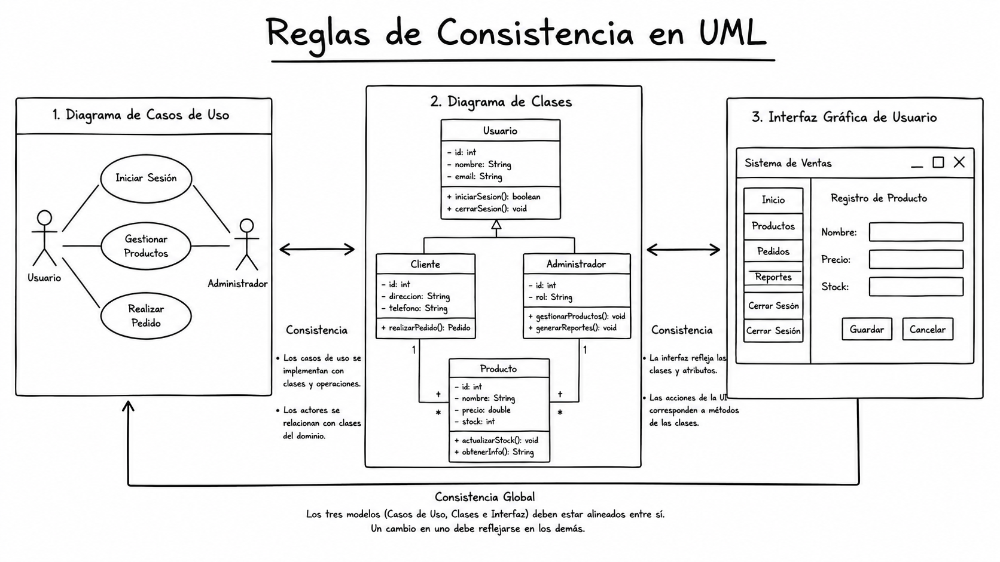

*Imagen generada con ChatGPT*

---

## Tabla de contenido

- [Introducción](#introducción)
- [Contexto y problemática](#contexto-y-problemática)
- [¿Qué son las reglas de consistencia?](#qué-son-las-reglas-de-consistencia)
- [OCL: Lenguaje de Restricciones de Objetos](#ocl-lenguaje-de-restricciones-de-objetos)
- [El modelo de interfaces (GUI)](#el-modelo-de-interfaces-gui)
- [Reglas de consistencia entre diagrama de clases y casos de uso](#reglas-de-consistencia-entre-diagrama-de-clases-y-casos-de-uso)
  - [Regla 1: Correspondencia sustantivo - clase](#regla-1-correspondencia-sustantivo---clase)
  - [Regla 2: Correspondencia verbo - operación](#regla-2-correspondencia-verbo---operación)
- [Reglas de consistencia con interfaces de usuario](#reglas-de-consistencia-con-interfaces-de-usuario)
  - [Regla 3: Título de interfaz - clase](#regla-3-título-de-interfaz---clase)
  - [Regla 4: Título de interfaz - operación](#regla-4-título-de-interfaz---operación)
  - [Regla 5: Botón de enviar - operación](#regla-5-botón-de-enviar---operación)
  - [Regla 6: Etiquetas de campos - atributos](#regla-6-etiquetas-de-campos---atributos)
  - [Regla 7: Título de interfaz - caso de uso](#regla-7-título-de-interfaz---caso-de-uso)
  - [Regla 8: Botón de enviar - caso de uso](#regla-8-botón-de-enviar---caso-de-uso)
- [Herramientas para verificar consistencia](#herramientas-para-verificar-consistencia)
- [Referencias](#referencias)
- [Recursos recomendados](#recursos-recomendados)

---

## Introducción

En el ciclo de vida del software, durante las fases de definición y análisis, se realiza una especificación de los requisitos. Para ello, es necesario realizar un proceso de captura de las necesidades y expectativas de los interesados (stakeholders), que se traduce posteriormente en un conjunto de modelos que representan tanto el problema como su solución. Por lo general, la mayoría de esos modelos se expresan en el **Lenguaje de Modelado Unificado (UML)**.

UML define un conjunto de artefactos que permiten especificar los requisitos del software, los cuales **deberían guardar consistencia** cuando se trate del mismo modelo. Sin embargo, la consistencia entre diferentes artefactos no se encuentra definida en la especificación de UML y poco se ha trabajado con este tipo de consistencia.

Las **reglas de consistencia** nos permiten la planeación para la construcción de nuestro Software, garantizando que los diferentes diagramas y artefactos de un proyecto estén alineados y no presenten contradicciones.

> **OCL (Object Constraint Language):** Es un lenguaje de especificación formal que permite definir restricciones sobre los modelos UML de manera precisa y sin ambigüedades.

---

## Contexto y problemática

### El problema de la consistencia intermodelos

Un proceso de desarrollo de software tiene como propósito la producción eficaz y eficiente de un producto software que cumpla con las necesidades y expectativas de los interesados. Este proceso empieza típicamente cuando se identifica un problema que puede requerir una solución computarizada.

Los métodos de desarrollo de software (como el Proceso Unificado) son iterativos e incrementales. El costo de los errores encontrados al principio en el ciclo de desarrollo es muy inferior al costo de los errores encontrados en los últimos pasos (codificación o pruebas). Por lo tanto, se debe tratar de hacer un buen análisis desde el principio del proceso, especialmente en la especificación de requisitos.

**Problemas actuales:**

1. La consistencia intermodelos no se especifica formalmente.
2. Solo se realizan algunos chequeos de consistencia de manera automática entre algunos artefactos y el código resultante.
3. En algunos trabajos se definen reglas de consistencia de manera formal pero solo en el nivel de intramodelo.

### Enfoque propuesto

En el artículo de Zapata y González (2008) se propone un método para verificar la consistencia entre el diagrama de clases y el diagrama de casos de uso de UML de una manera formal, evaluando una serie de reglas definidas en **OCL** que se deben cumplir para garantizar que la información brindada por dichos modelos sea consistente. Se define, adicionalmente, la consistencia con las **interfaces gráficas de usuario (GUI)**.

---

## ¿Qué son las reglas de consistencia?

Las reglas de consistencia son **condiciones que deben cumplir los diferentes artefactos de un modelo UML** para garantizar que la información que representan es coherente y no contradictoria.

| **Tipo de consistencia** | **Descripción** |
|--------------------------|-----------------|
| **Intramodelo** | Verifica que todos los elementos de un mismo diagrama o artefacto sean consistentes entre sí. |
| **Intermodelos** | Verifica la consistencia entre diferentes diagramas o artefactos que pertenecen al mismo modelo. |

La mayoría de las herramientas CASE actuales realizan chequeos de consistencia interna de los diagramas, pero se realizan pocas revisiones sobre la consistencia entre los diferentes diagramas o artefactos.

---

## OCL: Lenguaje de Restricciones de Objetos

**OCL (Object Constraint Language)** es un lenguaje de especificación formal que permite definir restricciones sobre los modelos UML. Fue desarrollado como parte del estándar UML y es utilizado para:

- **Definir invariantes** sobre clases y tipos.
- **Especificar condiciones previas y posteriores** para operaciones.
- **Describir restricciones** que deben cumplir los elementos de un modelo.

### Características principales

| **Característica** | **Descripción** |
|-------------------|-----------------|
| **Lenguaje de expresión** | No es un lenguaje de programación, sino de especificación. |
| **Sin efectos colaterales** | Las expresiones OCL no modifican el estado del sistema. |
| **Basado en conjuntos** | Opera sobre colecciones de objetos (Sets, Sequences, Bags). |
| **Navegación** | Permite navegar a través de las relaciones del modelo. |

### Sintaxis básica

```ocl
-- Contexto de la restricción
context NombreDeLaClase

-- Invariante
inv NombreDelInvariante: expresión_booleana

-- Precondición
pre NombreDeLaPrecondicion: expresión_booleana

-- Postcondición
post NombreDeLaPostcondicion: expresión_booleana
```

**Ejemplo de invariante:**

```ocl
context Persona
inv EdadValida: self.edad >= 0 and self.edad <= 120
```

---

## El modelo de interfaces (GUI)

El modelo de interfaces describe la presentación de información entre los actores y el sistema (Weitzenfeld, 2005). Es complementario con la información que se presenta en los diagramas de clases y casos de uso.

Una interfaz común consta de:
- **Título**: Verbo + sustantivo (ej. "Registrar Cliente")
- **Etiquetas (labels)**: Describen los campos
- **Campos de texto y selección**
- **Botón de enviar (submit)**
- **Botón de cancelar o salir**

Las interfaces gráficas de usuario son esenciales porque:
- Permiten a los interesados visualizar el sistema.
- Facilitan la validación de requisitos.
- Ayudan a eliminar malos entendidos.

---

## Reglas de consistencia entre diagrama de clases y casos de uso

### Diagrama de referencia

Para entender las reglas, utilizaremos los siguientes diagramas de ejemplo:

**Diagrama de Casos de Uso (Vista de alto nivel):**

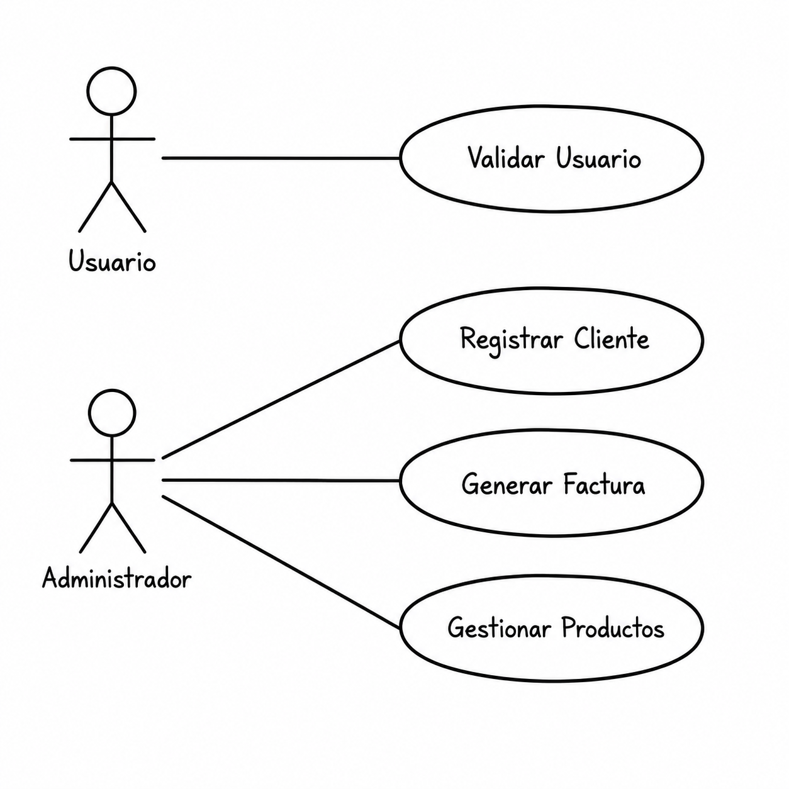

*Imagen generada con ChatGPT*

**Diagrama de Clases (Estructura):**

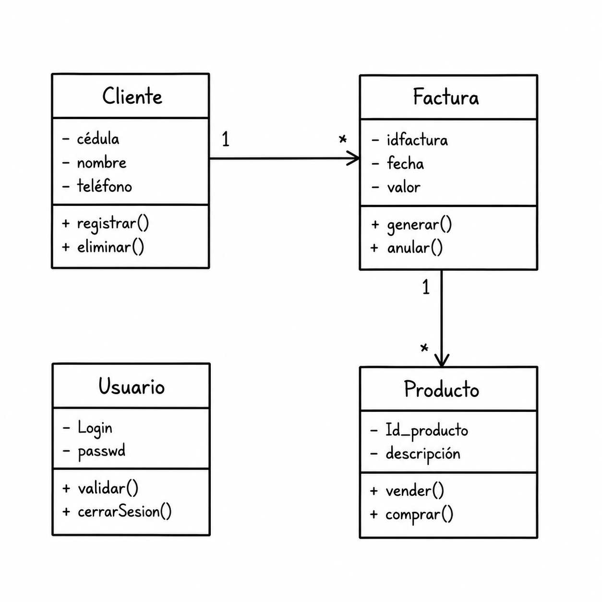

*Imagen generada con ChatGPT*

---

### Regla 1: Correspondencia sustantivo - clase

**Enunciado:** El nombre de un caso de uso debe incluir un verbo y un sustantivo. El sustantivo debe corresponder al nombre de una clase en el diagrama de clases.

> **Verbo:** Debe corresponder a una operación de una clase: *Registrar*
>
> **Sustantivo:** Siempre será candidato a ser clase: *Cliente*

**Ejemplo:** Caso de uso "Registrar Cliente" → Debe existir una clase "Cliente"

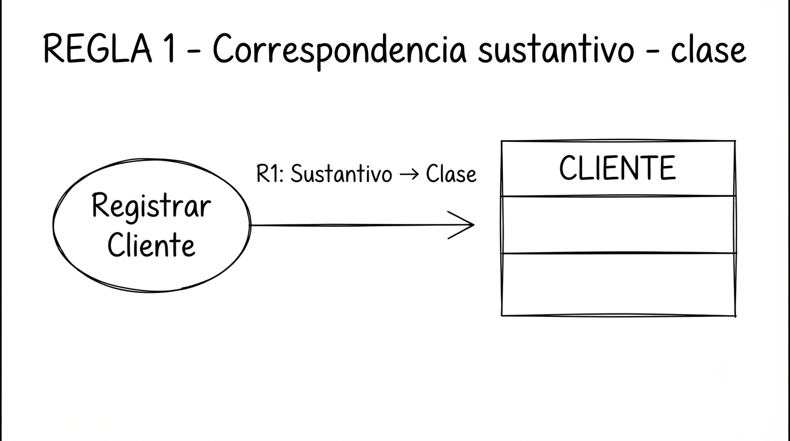

*Imagen generada con Gemini*

---

### Regla 2: Correspondencia verbo - operación

**Enunciado:** El nombre de un caso de uso debe incluir un verbo y un sustantivo. El verbo debe corresponder a una operación de una clase del diagrama de clases.

**Ejemplo:** Caso de uso "Registrar Cliente" → La clase "Cliente" debe tener una operación "registrar()"

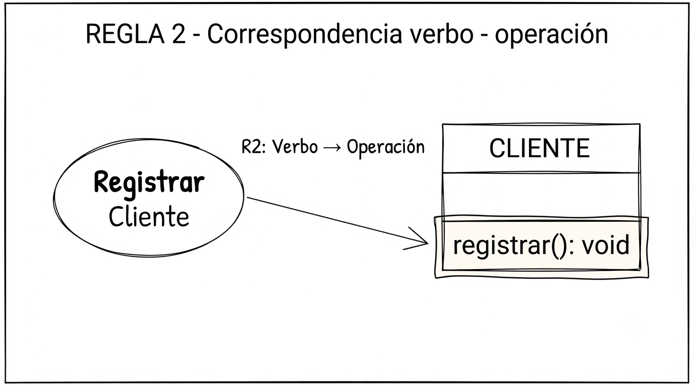

*Imagen generada con Gemini*

---

## Reglas de consistencia con interfaces de usuario

### Regla 3: Título de interfaz - clase

**Enunciado:** En el título de cada interfaz gráfica de usuario debe ir un verbo y un sustantivo. El sustantivo debe corresponder al nombre de una clase.

**Ejemplo:** Interfaz "Registrar Cliente" → Debe existir una clase "Cliente"

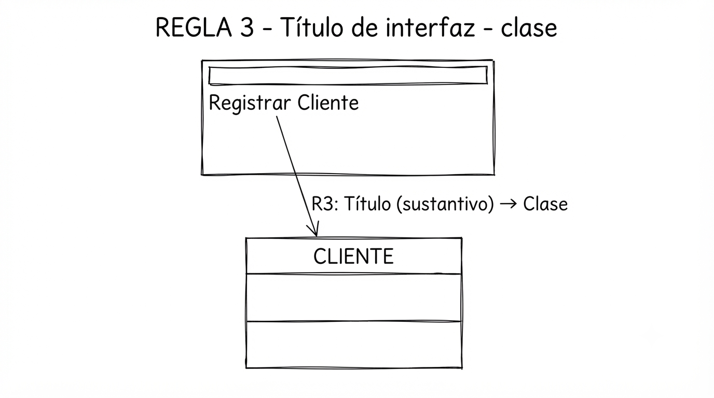

*Imagen generada con Gemini*

---

### Regla 4: Título de interfaz - operación

**Enunciado:** Una interfaz gráfica de usuario tiene en su título un verbo y un sustantivo. Dicho verbo debe corresponder a una operación de la clase identificada.

**Ejemplo:** Interfaz "Registrar Cliente" → La clase "Cliente" debe tener una operación "registrar()"

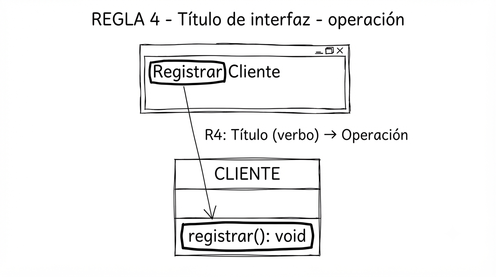

*Imagen generada con Gemini*

---

### Regla 5: Botón de enviar - operación

**Enunciado:** En una interfaz gráfica de usuario debe existir un botón de enviar (submit). Dicho botón tiene en su etiqueta un verbo que debe corresponder a una operación de una clase.

**Ejemplo:** Botón "Registrar" → La clase correspondiente debe tener una operación "registrar()"

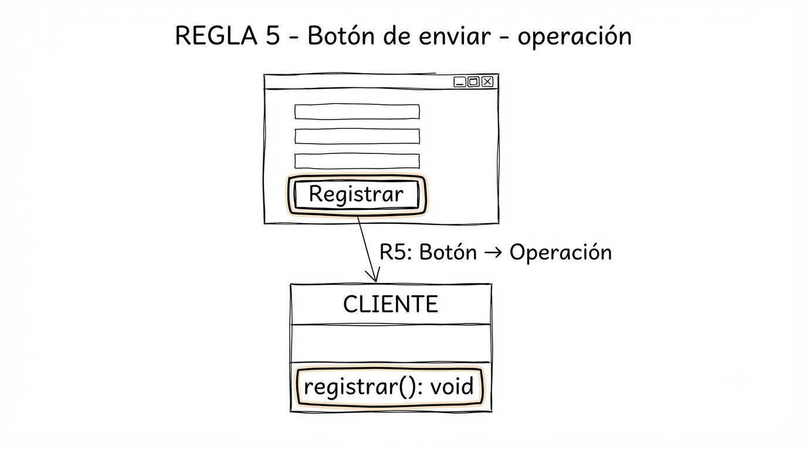

*Imagen generada con Gemini*

---

### Regla 6: Etiquetas de campos - atributos

**Enunciado:** Si una interfaz gráfica de usuario posee campos de texto, estos deben ir precedidos por etiquetas que deben tener sus atributos correspondientes en una clase.

**Ejemplo:** Etiqueta "Cédula" y campo de texto → La clase "Cliente" debe tener un atributo "cédula"

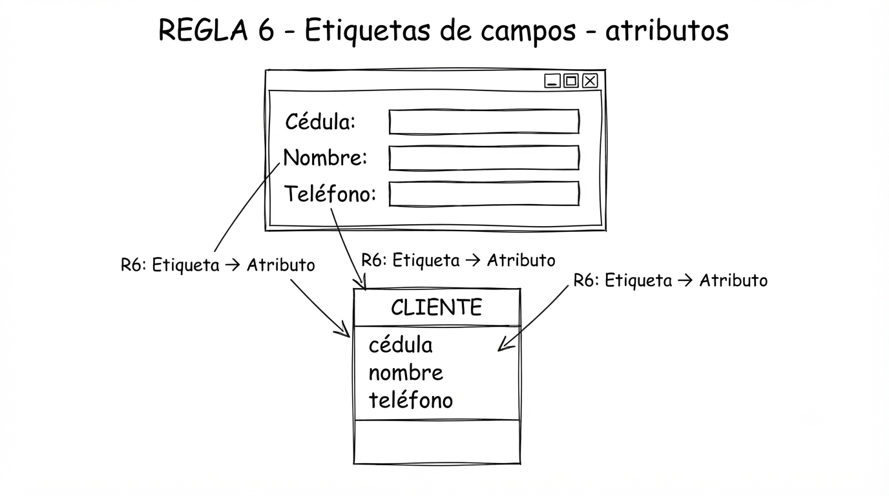

*Imagen generada con Gemini*

---

### Regla 7: Título de interfaz - caso de uso

**Enunciado:** En el título de cada interfaz gráfica de usuario debe ir un verbo y un sustantivo que correspondan con el nombre de un caso de uso.

**Ejemplo:** Interfaz "Registrar Cliente" → Debe existir un caso de uso "Registrar Cliente"

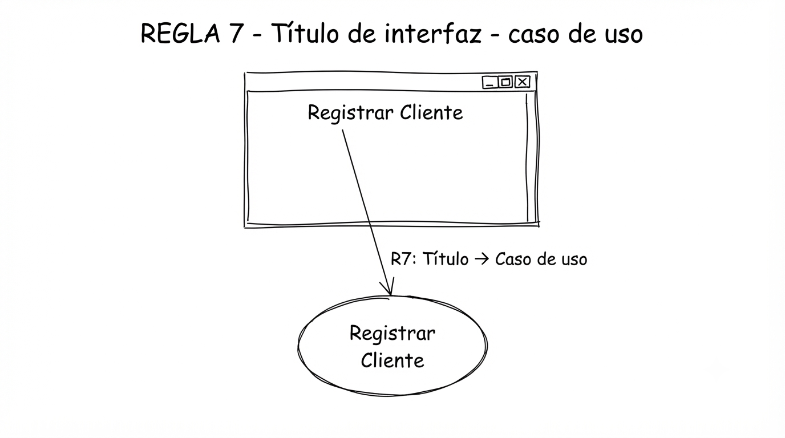

*Imagen generada con Gemini*

---

### Regla 8: Botón de enviar - caso de uso

**Enunciado:** Un botón de enviar tiene en su etiqueta un verbo que debe corresponder a un verbo de un nombre de un caso de uso.

**Ejemplo:** Botón "Registrar" → Debe existir un caso de uso que contenga el verbo "Registrar"

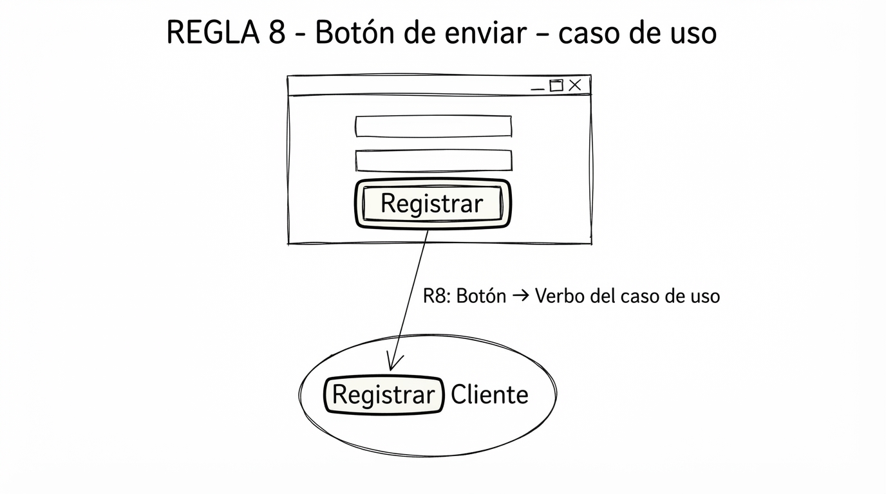

*Imagen generada con Gemini*

---

## Herramientas para verificar consistencia

| **Herramienta** | **Descripción** | **Enlace** |
|-----------------|-----------------|------------|
| **StarUML** | Herramienta CASE moderna con soporte para UML 2.0. | [staruml.io](https://staruml.io) |

### Formatos de intercambio

| **Formato** | **Descripción** | **Enlace** |
|-------------|-----------------|------------|
| **XMI** | XML Metadata Interchange - Estándar OMG para intercambio de metadatos. | [omg.org/technology/xml](http://www.omg.org/technology/xml/) |
| **XML** | Extensible Markup Language - Lenguaje de marcado para datos estructurados. | [w3.org/XML](https://www.w3.org/XML/) |
| **XPath** | Lenguaje para navegar en documentos XML. | [w3.org/XPath](https://www.w3.org/TR/xpath/) |

---

## Referencias

- ZAPATA, C.M. y GONZÁLEZ, G., 2008. *Especificación formal en OCL de reglas de consistencia entre los diagramas de clases y casos de uso de UML y el modelo de interfaces*. Revista Ingenierías Universidad de Medellín, 7(12), 169-191.

---

## Recursos recomendados

### Lecturas recomendadas

- [Diagrama de clases - Lucidchart](https://lucid.co/es/diagrama/uml/tutorial-diagrama-de-clases)
- [Qué es un diagrama de clases UML - Miro](https://miro.com/es/diagrama/que-es-diagrama-clases-uml/)
- [Diagrama de clases - Wikipedia](https://es.wikipedia.org/wiki/Diagrama_de_clases)

### Especificaciones oficiales

- [OCL 2.4 Specification - OMG](https://www.omg.org/spec/OCL/2.4/PDF)
- [Object Constraint Language - Wikipedia](https://en.wikipedia.org/wiki/Object_Constraint_Language)

### Sitios web oficiales

- [OMG UML Specification](https://www.omg.org/spec/UML/) – Especificación oficial de UML.
- [OCL Specification](https://www.omg.org/spec/OCL/) – Especificación oficial de OCL.
- [W3C XML](https://www.w3.org/XML/) – Estándares XML.
- [XMI Specification](https://www.omg.org/spec/XMI/) – Especificación de XMI.

### Artículos relacionados

- [SciELO - Especificación formal en OCL](http://www.scielo.org.co/scielo.php?script=sci_arttext&pid=S1692-33242008000100010)

---

## Conclusión

Las reglas de consistencia entre los diagramas de clases, casos de uso e interfaces de usuario son fundamentales para garantizar la calidad y coherencia de los modelos de software. El uso de **OCL** permite especificar estas reglas de manera formal y precisa, facilitando su verificación automática y reduciendo la probabilidad de errores en fases tempranas del desarrollo.

Al integrar las interfaces de usuario en las reglas de consistencia, se logra:
- Validar la correspondencia de los atributos de las clases con los casos de uso.
- Garantizar que los prototipos de interfaz sean consistentes con los modelos.
- Reducir la ambigüedad en la comunicación entre analistas y stakeholders.

> **El diagrama de clases debe dar solución al diagrama de casos de uso, y las interfaces deben reflejar esa solución de manera coherente.**