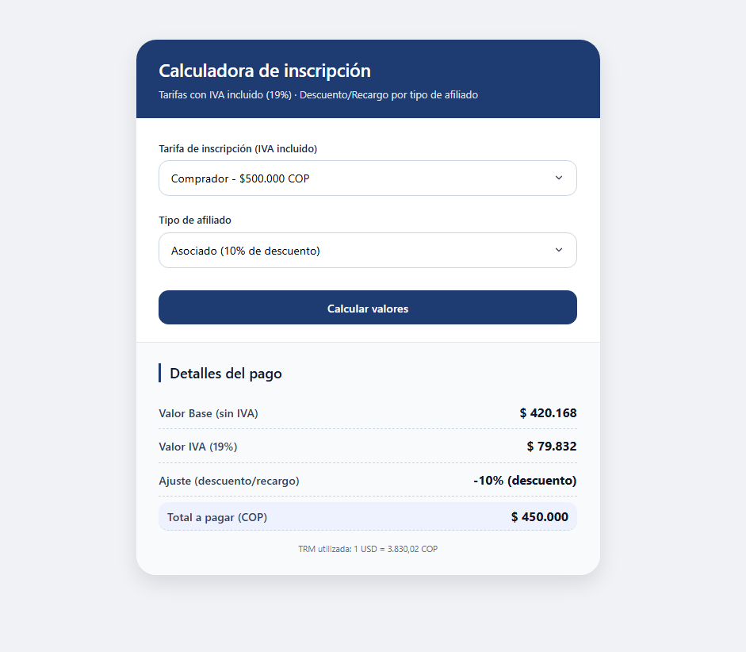

# Prueba Técnica Desarrollo de Software – Solución

## 1. Introducción

Un compañero del programa ADSO (Análisis y Desarrollo de Software) me compartió un PDF con una prueba técnica para desarrolladores. La prueba plantea un cálculo financiero para diferentes tipos de afiliados y tarifas de inscripción, y solicita implementar un formulario interactivo con JavaScript. Me pareció muy interesante porque, además de evaluar lógica de programación, incluye conceptos de impuestos, descuentos, recargos y conversión de moneda. A continuación presento el análisis, la solución y una reflexión sobre el uso de herramientas de IA en procesos de selección.

> Este tema es muy importante para temas de **Contrato de Aprendizaje**. En ese entonces tenia mucho interes en este tipo de cosas porque estaba en busqueda de uno.

## 2. Enunciado original (adaptado)

**Prueba Técnica Desarrollo de Software**

Requisitos del programa:

- Valor Base: según la tarifa de inscripción seleccionada.
- Valor de IVA: considerando un IVA del 19%.
- Valor Total a Pagar: resultado del valor base más IVA y ajustes.
- Porcentaje de Descuento o Recargo.

**Tarifas de Inscripción (IVA incluido):**

| Perfil      | Costo (COP) |
|-------------|-------------|
| Comprador   | $500.000    |
| Vendedor    | $400.000    |
| Expositor   | $120.000    |

**Tipos de afiliado:**

- **Asociado** → 10% de descuento sobre el valor total.
- **No Asociado** → 10% de recargo sobre el valor total.
- **Extranjero** → pago en dólares (USD), convirtiendo la tarifa con la TRM.

**TRM (Tasa Representativa del Mercado):** $3.830,02 COP por USD.

**Adicional:** diseñar un formulario sencillo que permita seleccionar el tipo de afiliado y la tarifa de inscripción, mostrando todos los valores calculados.

## 3. Enfoque de solución

### 3.1 Interpretación del modelo financiero

Las tarifas indicadas **ya incluyen el 19% de IVA**. Por lo tanto:

- `Valor Base (sin IVA) = Tarifa / 1.19`
- `Valor IVA = Tarifa - Valor Base`
- `Subtotal (base + IVA) = Tarifa`

Los ajustes (descuento o recargo) se aplican sobre el **subtotal** (tarifa con IVA incluido).

**Reglas por tipo de afiliado:**

| Tipo         | Ajuste                                         |
|--------------|------------------------------------------------|
| Asociado     | 10% de descuento → Total = Tarifa * 0.90       |
| No Asociado  | 10% de recargo  → Total = Tarifa * 1.10        |
| Extranjero   | Sin descuento/recargo, pero el total se muestra también en USD |

Para **Extranjero** se calcula: `Total USD = Total COP / TRM`

### 3.2 Estructura técnica

Se construyó una **aplicación web monolítica** (un solo archivo HTML) que integra:

- **HTML5 semántico** con un formulario accesible.
- **CSS3** con diseño responsivo (flexbox), colores neutros, tarjeta central y tipografía legible.
- **JavaScript puro** (sin frameworks) que:
  - Escucha el evento `submit` del formulario.
  - Lee los valores seleccionados (tarifa y tipo de afiliado).
  - Realiza los cálculos descritos.
  - Actualiza dinámicamente una sección de resultados.

### 3.3 Manejo de errores y decimales

- Los valores monetarios se muestran con formato de miles (`.toLocaleString('es-CO')`) y dos decimales.
- La TRM se usa con punto como separador decimal.
- Se previene la recarga de página al enviar el formulario (`event.preventDefault()`).

## 4. Fragmentos de código relevantes

### 4.1 Cálculo central (JavaScript)

```javascript
function calcular(event) {
    event.preventDefault();
    
    const tarifa = parseFloat(document.getElementById('tarifa').value);
    const tipo = document.getElementById('tipo').value;
    
    // Base e IVA a partir de tarifa con IVA incluido
    const base = tarifa / 1.19;
    const iva = tarifa - base;
    let totalCOP = tarifa;
    let ajustePorcentaje = 0;
    
    if (tipo === 'asociado') {
        totalCOP = tarifa * 0.9;
        ajustePorcentaje = -10;
    } else if (tipo === 'noAsociado') {
        totalCOP = tarifa * 1.1;
        ajustePorcentaje = 10;
    } else if (tipo === 'extranjero') {
        // sin ajuste, solo conversión a USD
        ajustePorcentaje = 0;
    }
    
    const usdTotal = tipo === 'extranjero' ? totalCOP / TRM : null;
    
    // Mostrar resultados...
}
```

### 4.2 Estructura del formulario (HTML)

```html
<form id="calculatorForm">
    <label for="tarifa">Tarifa de inscripción (IVA incluido):</label>
    <select id="tarifa" required>
        <option value="500000">Comprador - $500.000</option>
        <option value="400000">Vendedor - $400.000</option>
        <option value="120000">Expositor - $120.000</option>
    </select>

    <label for="tipo">Tipo de afiliado:</label>
    <select id="tipo" required>
        <option value="asociado">Asociado (10% descuento)</option>
        <option value="noAsociado">No Asociado (10% recargo)</option>
        <option value="extranjero">Extranjero (pago en USD)</option>
    </select>

    <button type="submit">Calcular</button>
</form>
```

## 5. Uso de IA en el desarrollo

Siguiendo las instrucciones de la prueba (que permitían emplear herramientas de IA), utilicé un asistente conversacional. A continuación detallo la interacción.

### 5.1 Pregunta realizada a la IA

> "Tengo que resolver una prueba técnica que pide calcular valor base, IVA, total a pagar, descuento/recargo y conversión a USD. Las tarifas ya incluyen IVA (19%). Los tipos de afiliado: Asociado (10% descuento), No Asociado (10% recargo), Extranjero (convertir a USD sin ajuste). Necesito un formulario HTML/CSS/JS que muestre los resultados de forma clara. ¿Cómo estructuro el cálculo y la interfaz?"

### 5.2 Respuesta de la IA (resumida)

La IA propuso:
- Calcular base = tarifa / 1.19; IVA = tarifa - base.
- Aplicar descuento/recargo sobre la tarifa (total con IVA).
- Para extranjero, convertir el total COP a USD usando TRM.
- Diseñar una tarjeta con selects y una zona de resultados dinámica.
- Usar `toLocaleString` para formato de moneda.

### 5.3 Lo que decidí aplicar y por qué

- **Modelo base + IVA desde tarifa incluida**: la IA confirmó que era correcto matemáticamente y se ajusta a la ley colombiana.  
- **Descuento/recargo sobre el total con IVA**: porque el enunciado dice "sobre el valor total" (que incluye IVA).  
- **Extranjero sin descuento/recargo**: la IA notó que el requisito no especifica combinación, así que se trató como categoría independiente.  
- **Conversión a USD solo para extranjero**: mejora la experiencia del usuario mostrando el valor en ambas monedas.  
- **Formulario sin recarga de página**: facilita la iteración rápida.

### 5.4 Lo que NO apliqué y por qué

- **Separar el IVA como un porcentaje aplicado al valor base**: el enunciado dice "tarifas de inscripción IVA incluido", por lo que no tenía sentido volver a añadir IVA.  
- **Permitir que un extranjero sea también asociado o no asociado**: el PDF lista los tipos como mutuamente excluyentes; agregar combinaciones habría sobrecomplicado la lógica sin beneficio claro.  
- **Usar bibliotecas externas (Bootstrap, jQuery)**: se pidió una solución sencilla y autónoma; el CSS puro es suficiente y más liviano.

## 6. Repositorio GIT

Se integro en este repositorio y por ende:

* El código fuente está disponible en: [Repo ADSO - Prueba Técnica](https://github.com/santiagoencodigo/analisis-y-desarrollo-de-software/tree/main/trimestre-3/prueba-tecnica "https://github.com/santiagoencodigo/analisis-y-desarrollo-de-software/tree/main/trimestre-3/prueba-tecnica")

* Demo en Vivo: [prueba-tecnica](https://santiagoencodigo.github.io/analisis-y-desarrollo-de-software/trimestre-3/prueba-tecnica/index.html "https://santiagoencodigo.github.io/analisis-y-desarrollo-de-software/trimestre-3/prueba-tecnica/index.html")



## 7. Reflexión personal sobre el uso de IA en entrevistas técnicas

Me pareció increíble que la prueba aceptara explícitamente el uso de IA. Esto hace que el proceso sea mucho más accesible y realista, porque en el día a día los desarrolladores utilizan todo tipo de herramientas para ser más productivos. Sin embargo, no basta con copiar y pegar: hay que saber **qué preguntar**, **cómo interpretar la respuesta** y **qué partes adaptar** al contexto específico.

En este caso, la IA propuso una estructura limpia, pero fui yo quien decidió cómo manejar la ambigüedad del IVA incluido y la exclusividad de los tipos de afiliado. También corregí detalles de formato y validación. La IA acelera la escritura de código repetitivo (CSS, eventos DOM), pero el criterio técnico y la comprensión del negocio siguen siendo responsabilidad del desarrollador.

En conclusión, saber interactuar con la IA es una habilidad valiosa: formular buenas preguntas, verificar la lógica y ensamblar las piezas es lo que realmente marca la diferencia en una prueba técnica moderna.

## 8. Instrucciones para ejecutar la solución

1. Guardar el archivo `index.html` (ver segunda parte de esta entrega) en cualquier carpeta.
2. Abrirlo con un navegador web moderno (Chrome, Edge, Firefox).
3. Seleccionar una tarifa y un tipo de afiliado.
4. Presionar "Calcular" para ver los desgloses.

No requiere conexión a internet ni dependencias externas.