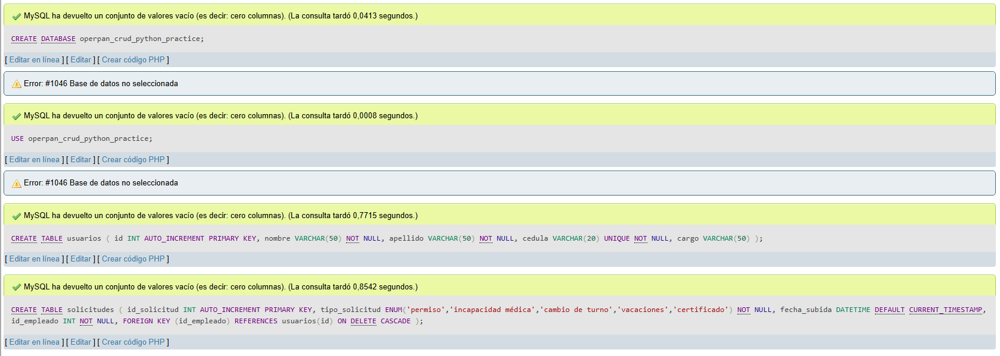
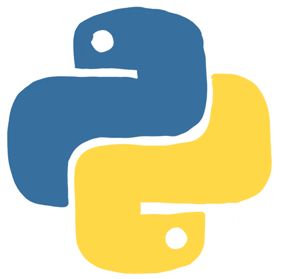

# Crud OperPan

> 17/06/2026
>
> Tengo un examen de CRUD con python nativo. Por lo que al mirar, tengo este proyecto incompleto. Por lo que lo finalizaré y lo utilizaré como repaso.
>
> Como estrategia lo miraré todo desde GitHub y en este documento estaré redactando lo que piense.


---

Antes de iniciar del paso a paso, del cómo se creo este pequeño proyecto

Si vas a iniciarlo o clonas este repositorio, a continuación la forma de correrlo:

El archivo `requirements.txt` debe contener la dependencia principal que estás utilizando: el conector de MySQL para Python. 

**Contenido de `requirements.txt`:**

```
mysql-connector-python==9.7.0
numpy==2.2.6
```

Por ende ejecute en la terminal el siguente comando para la instalación de las dependencias.

```bash
pip install -r requirements.txt
```

Esto instalará automáticamente el conector de MySQL en su máquina, permitiendo que el programa se ejecute sin errores de importación.

¿Cómo se genera automáticamente? (por si quieres actualizarlo luego)

Si ya tienes instalado `mysql-connector-python` en tu entorno, puedes generar el archivo con el siguente comando:

```bash
pip freeze > requirements.txt
```

---


No hay uso de ningún framework y lo importante es el código en si mismo siendo una crud hecha con python conectandola con una base de datos mysql sin interfaz gráfica.

Como primer paso, se debe crear una base de datos y crearle una tabla con sus respectivos campos.

> En este momento me dí cuenta de que esta sección tenia carpetas y archivos que estaban vacio. Por lo que dejaré de lado la entidad cargo de OperPan (nombre de mi proyecto formativo) para desarrollar usuarios y solicitudes del empleado.

Entonces siendo asi:

¿Cómo se va a llamar la base de datos?

> Activo XAMPP y abro phpmyadmin

* Creare una base de datos llamada operpan_crud_python_practice
* Creare la tabla usuarios con los campos id como primary key, nombre, apellido, cedula, cargo.
* Creare la tabla solicitudes con los campos id_solicitud, tipo_solicitud (que contenga un enum entre permiso, incapacidad médica, cambio de turno, vacaciones, certificado), fecha de subida de solicitud, id del empleado como foreign key

Por lo que:

```sql
    CREATE DATABASE operpan_crud_python_practice;
    USE operpan_crud_python_practice;

    CREATE TABLE usuarios (
        id INT AUTO_INCREMENT PRIMARY KEY,
        nombre VARCHAR(50) NOT NULL,
        apellido VARCHAR(50) NOT NULL,
        cedula VARCHAR(20) UNIQUE NOT NULL,
        cargo VARCHAR(50)
    );

    CREATE TABLE solicitudes (
        id_solicitud INT AUTO_INCREMENT PRIMARY KEY,
        tipo_solicitud ENUM('permiso','incapacidad médica','cambio de turno','vacaciones','certificado') NOT NULL,
        fecha_subida DATETIME DEFAULT CURRENT_TIMESTAMP,
        id_empleado INT NOT NULL,
        FOREIGN KEY (id_empleado) REFERENCES usuarios(id) ON DELETE CASCADE
    );
```



---

Ahora entonces crearemos las carpetas y archivos:

```bash
    mkdir config - touch db.py

    mkdir models - touch usuario.py & touch solicitud_empleado.py

    mkdir services - usuario_service.py & touch solicitud_empleado_service.py
```

> Eventualmente crearemos los archivos para solicitudes.

Y toca entonces instalar tambien las dependencias

Por ende ejecutar el comando en la terminal de visual studio (Se puede en command prompt o en bash):

**pip install mysql-connector-python**

Y si no funciona: **py -m pip install mysql-connector-python**

---

Ya una vez instala la dependencia y creada la base de datos con las tablas. 

Vamos entonces al archivo config/db.py

y escribimos entonces el código:

```python
    # Importamos la dependencia de MYSQL
    import mysql.connector

    class Database:
        # Creamos nuestro constructor sin parametros
        def __init__(self):
            # Atributo con el valor none porque inicialmente no tiene nada.
            self.connection = None
        
        # Ahora creamos entonces nuestro metodo (Contexto de Clases)/funcion (Contexto General) connect de la clase Database
        # No tiene otros parametros más que si mismo.        
        # ¿Cual será la misión de este metodo? - Conectar la base de datos.
        def connect(self):
            # Conectamos esta función con nuestra importación de la dependencia
            self.connection = mysql.connector.connect(
                host="localhost", # Estamos en el equipo asi que sí, localhost.
                user="root", # user por defecto
                password="", # Comillas vacias porque no tenemos contraseña.
                # En nuestro contexto el nombre de nuestra base de datos es: operpan_crud_python_practice
                database="operpan_crud_python_practice"
            )
            print("Conectado") # Si las cosas bien, vamos a imprimirlo!

        def get_cursor(self):
            return self.connection.cursor()

        # Para guardar.
        def commit(self):
            self.connection.commit()
                
        # Si ya terminé de hacer lo que tenia que hacer, esta función quitará la conexión con la BD.
        def close(self):
            self.connection.close
```

Ahora vamos a configurar nuestros modelos, aqui entonces debemos tener muy en cuenta lo que tenemos en nuestra base de datos respecto al modelo que vamos a hacer.

En este caso tenemos dos modelos, dejaré el código por modelo a un lado:

1. usuario.py

```python
    # models/usuario.py
    class Usuario:
        def __init__(self, nombre, apellido, cedula, cargo, id=None):
            self.id = id
            self.nombre = nombre
            self.apellido = apellido
            self.cedula = cedula
            self.cargo = cargo

        def __str__(self):
            return f"{self.id} - {self.nombre} {self.apellido} - {self.cedula} - {self.cargo}"
```

2. solicitud_empleado.py

```python
    class SolicitudEmpleado:
        def __init__(self, tipo_solicitud, fecha_subida, id_empleado, id_solicitud=None):
            # Completa con los atributos correctos
            self.id_solicitud = id_solicitud
            self.tipo_solicitud = tipo_solicitud
            self.fecha_subida = fecha_subida
            self.id_empleado = id_empleado

        def __str__(self):
            return f"{self.id_solicitud} - {self.tipo_solicitud} - {self.fecha_subida} - Empleado: {self.id_empleado}"
```

Ahora entonces que ya tenemos la base de datos, el código de config/db.py y nuestros modelos, pasaremos a nuestros servicios o toda la lógica de negocio o el crud. Que en otras palabras es nuestra simulación de backend teniendo asi una funcionalidad de crud.

Entonces:

1. services/usuario_service.py:

```python
    # services/usuario_service.py
    from models.usuario import Usuario

    class UsuarioService:
        def __init__(self, db):
            self.db = db

        def crear(self, usuario):
            # usuario es una instancia de Usuario sin id (o con id None)
            cursor = self.db.get_cursor()
            query = "INSERT INTO usuarios (nombre, apellido, cedula, cargo) VALUES (%s, %s, %s, %s)"
            valores = (usuario.nombre, usuario.apellido, usuario.cedula, usuario.cargo)
            cursor.execute(query, valores)
            self.db.commit()
            # Obtener el id generado y asignarlo al objeto usuario
            usuario.id = cursor.lastrowid
            return usuario  # opcional

        def listar(self):
            cursor = self.db.get_cursor()
            cursor.execute("SELECT id, nombre, apellido, cedula, cargo FROM usuarios")
            datos = cursor.fetchall()
            usuarios = []
            for fila in datos:
                # fila: (id, nombre, apellido, cedula, cargo)
                usuario = Usuario(fila[1], fila[2], fila[3], fila[4], fila[0])
                usuarios.append(usuario)
            return usuarios

        def obtener_por_id(self, id_usuario):
            cursor = self.db.get_cursor()
            cursor.execute("SELECT id, nombre, apellido, cedula, cargo FROM usuarios WHERE id = %s", (id_usuario,))
            fila = cursor.fetchone()
            if fila:
                return Usuario(fila[1], fila[2], fila[3], fila[4], fila[0])
            return None

        def actualizar(self, usuario):
            # usuario debe tener id, y los campos a actualizar
            cursor = self.db.get_cursor()
            query = "UPDATE usuarios SET nombre=%s, apellido=%s, cedula=%s, cargo=%s WHERE id=%s"
            valores = (usuario.nombre, usuario.apellido, usuario.cedula, usuario.cargo, usuario.id)
            cursor.execute(query, valores)
            self.db.commit()

        def eliminar(self, id_usuario):
            cursor = self.db.get_cursor()
            cursor.execute("DELETE FROM usuarios WHERE id=%s", (id_usuario,))
            self.db.commit()
```

2. services/solicitud_empleado_service.py:

```python
    # services/solicitud_empleado_service.py
    from models.solicitud_empleado import SolicitudEmpleado

    class SolicitudEmpleadoService:
        def __init__(self, db):
            self.db = db

        def crear(self, solicitud):
            # solicitud es una instancia sin id_solicitud, y probablemente sin fecha (se genera en BD)
            cursor = self.db.get_cursor()
            query = "INSERT INTO solicitudes (tipo_solicitud, id_empleado) VALUES (%s, %s)"
            valores = (solicitud.tipo_solicitud, solicitud.id_empleado)
            cursor.execute(query, valores)
            self.db.commit()
            solicitud.id_solicitud = cursor.lastrowid
            # Para obtener la fecha generada, podemos hacer una consulta adicional o usar NOW() en la inserción y luego leerla.
            # Opción: después del commit, consultar la fecha:
            cursor.execute("SELECT fecha_subida FROM solicitudes WHERE id_solicitud = %s", (solicitud.id_solicitud,))
            fecha = cursor.fetchone()[0]
            solicitud.fecha_subida = fecha
            return solicitud

        def listar(self):
            cursor = self.db.get_cursor()
            cursor.execute("SELECT id_solicitud, tipo_solicitud, fecha_subida, id_empleado FROM solicitudes")
            datos = cursor.fetchall()
            solicitudes = []
            for fila in datos:
                solicitud = SolicitudEmpleado(fila[1], fila[2], fila[3], fila[0])
                solicitudes.append(solicitud)
            return solicitudes

        def obtener_por_id(self, id_solicitud):
            cursor = self.db.get_cursor()
            cursor.execute("SELECT id_solicitud, tipo_solicitud, fecha_subida, id_empleado FROM solicitudes WHERE id_solicitud = %s", (id_solicitud,))
            fila = cursor.fetchone()
            if fila:
                return SolicitudEmpleado(fila[1], fila[2], fila[3], fila[0])
            return None

        def listar_por_empleado(self, id_empleado):
            cursor = self.db.get_cursor()
            cursor.execute("SELECT id_solicitud, tipo_solicitud, fecha_subida, id_empleado FROM solicitudes WHERE id_empleado = %s", (id_empleado,))
            datos = cursor.fetchall()
            solicitudes = []
            for fila in datos:
                solicitud = SolicitudEmpleado(fila[1], fila[2], fila[3], fila[0])
                solicitudes.append(solicitud)
            return solicitudes

        def eliminar(self, id_solicitud):
            cursor = self.db.get_cursor()
            cursor.execute("DELETE FROM solicitudes WHERE id_solicitud=%s", (id_solicitud,))
            self.db.commit()

        # Opcional: actualizar (si se permite cambiar tipo_solicitud, por ejemplo)
        def actualizar(self, solicitud):
            cursor = self.db.get_cursor()
            query = "UPDATE solicitudes SET tipo_solicitud=%s WHERE id_solicitud=%s"
            valores = (solicitud.tipo_solicitud, solicitud.id_solicitud)
            cursor.execute(query, valores)
            self.db.commit()
```

Ahora entonces finalmente, nos toca realizar el ultimo paso que consiste en editar nuestro archivo main.py el cual tendrá el menú  principal con el que insertaremos los datos y crearemos nuevas cosas como tal, en otras palabras nuestra interfaz en terminal para interactuar con nuestra base de datos.

main.py:

```python
    # main.py
    from config.db import Database
    from services.usuario_service import UsuarioService
    from services.solicitud_empleado_service import SolicitudEmpleadoService
    from models.usuario import Usuario
    from models.solicitud_empleado import SolicitudEmpleado

    def main():
        # Crear objeto de conexión a la base de datos
        db = Database()
        db.connect()

        # Crear los servicios pasando la conexión (inyección de dependencias)
        usuario_service = UsuarioService(db)
        solicitud_service = SolicitudEmpleadoService(db)

        while True:
            # Menú principal: elegir qué entidad gestionar
            print("\n=== MENÚ PRINCIPAL ===")
            print("1. Gestionar Usuarios")
            print("2. Gestionar Solicitudes")
            print("3. Salir")
            opcion_principal = input("Opción: ")

            if opcion_principal == "1":
                # Submenú para usuarios
                while True:
                    print("\n--- USUARIOS ---")
                    print("1. Crear usuario")
                    print("2. Listar usuarios")
                    print("3. Actualizar usuario")
                    print("4. Eliminar usuario")
                    print("5. Volver al menú principal")
                    op = input("Opción: ")

                    if op == "1":
                        nombre = input("Nombre: ")
                        apellido = input("Apellido: ")
                        cedula = input("Cédula: ")
                        cargo = input("Cargo: ")
                        # Se crea un objeto Usuario (sin id, se generará en la BD)
                        usuario = Usuario(nombre, apellido, cedula, cargo)
                        usuario_service.crear(usuario)
                        print("Usuario creado correctamente.")

                    elif op == "2":
                        usuarios = usuario_service.listar()
                        if not usuarios:
                            print("No hay usuarios registrados.")
                        else:
                            for u in usuarios:
                                print(u)  # Usa el método __str__ definido en el modelo

                    elif op == "3":
                        id_usuario = int(input("ID del usuario a actualizar: "))
                        # Primero obtenemos el usuario actual (opcional, pero pedimos todos los datos)
                        nombre = input("Nuevo nombre: ")
                        apellido = input("Nuevo apellido: ")
                        cedula = input("Nueva cédula: ")
                        cargo = input("Nuevo cargo: ")
                        usuario = Usuario(nombre, apellido, cedula, cargo, id_usuario)
                        usuario_service.actualizar(usuario)
                        print("Usuario actualizado.")

                    elif op == "4":
                        id_usuario = int(input("ID del usuario a eliminar: "))
                        usuario_service.eliminar(id_usuario)
                        print("Usuario eliminado (si existía).")

                    elif op == "5":
                        break  # Vuelve al menú principal

                    else:
                        print("Opción no válida.")

            elif opcion_principal == "2":
                # Submenú para solicitudes
                while True:
                    print("\n--- SOLICITUDES ---")
                    print("1. Crear solicitud")
                    print("2. Listar todas las solicitudes")
                    print("3. Listar solicitudes por empleado")
                    print("4. Eliminar solicitud")
                    print("5. Volver al menú principal")
                    op = input("Opción: ")

                    if op == "1":
                        # Mostrar tipos de solicitud posibles (según el ENUM)
                        print("Tipos permitidos: permiso, incapacidad médica, cambio de turno, vacaciones, certificado")
                        tipo = input("Tipo de solicitud: ")
                        id_empleado = int(input("ID del empleado: "))
                        solicitud = SolicitudEmpleado(tipo, None, id_empleado)  # fecha_subida se genera en la BD
                        solicitud_service.crear(solicitud)
                        print("Solicitud creada. Fecha asignada: ", solicitud.fecha_subida)

                    elif op == "2":
                        solicitudes = solicitud_service.listar()
                        if not solicitudes:
                            print("No hay solicitudes.")
                        else:
                            for s in solicitudes:
                                print(s)

                    elif op == "3":
                        id_empleado = int(input("ID del empleado: "))
                        solicitudes = solicitud_service.listar_por_empleado(id_empleado)
                        if not solicitudes:
                            print("El empleado no tiene solicitudes.")
                        else:
                            for s in solicitudes:
                                print(s)

                    elif op == "4":
                        id_solicitud = int(input("ID de la solicitud a eliminar: "))
                        solicitud_service.eliminar(id_solicitud)
                        print("Solicitud eliminada (si existía).")

                    elif op == "5":
                        break  # Vuelve al menú principal

                    else:
                        print("Opción no válida.")

            elif opcion_principal == "3":
                db.close()
                print("Conexión cerrada. ¡Hasta luego!")
                break

            else:
                print("Opción no válida.")

    # Punto de entrada estándar
    if __name__ == "__main__":
        main()
```

---

Entonces ahora por finalizar, podriamos estar en nuestra terminal y escribir teniendo en cuenta que debemos estar ubicados en la carpeta raiz: python main.py o sino ejecutarlo desde el icono de start que aparece en visual studio teniendo las extensiones de python.

Lo que construimos es una aplicación de consola en Python con arquitectura por capas (Layered Architecture) que realiza operaciones CRUD (Crear, Leer, Actualizar, Eliminar) sobre dos entidades relacionadas (Usuarios y Solicitudes) en una base de datos MySQL.

El flujo técnico paso a paso fue:

Modelado de la Base de Datos (Diseño físico):

Creamos un esquema (operpan_crud_python_practice) en MySQL.

Definimos la tabla usuarios (con campos: id, nombre, apellido, cedula, cargo).

Definimos la tabla solicitudes (con id, tipo_solicitud tipo ENUM, fecha_subida con valor por defecto CURRENT_TIMESTAMP, y una llave foránea id_empleado que referencia a usuarios(id) con ON DELETE CASCADE). Esto garantiza la integridad referencial.

---

Capa de Infraestructura / Conexión (config/db.py):

Creamos una clase Database que encapsula la lógica de conexión con mysql.connector.

Implementamos métodos connect() (para establecer el enlace), get_cursor() (para ejecutar consultas), commit() (para persistir cambios) y close() (para liberar recursos). Esto abstrae los detalles de la conexión para el resto del programa.

---

Capa de Modelos (models/):

Creamos clases Usuario y SolicitudEmpleado.

Estas clases son POJOs (Plain Old Java/Python Objects) o DTOs (Data Transfer Objects). Su única misión es representar una fila de la tabla como un objeto en memoria.

Definimos su constructor (__init__) para mapear los campos de la tabla a atributos del objeto, y el método __str__ para facilitar la impresión legible en consola.

---

Capa de Servicios / Lógica de Negocio (services/):

Creamos UsuarioService y SolicitudEmpleadoService.

Aplicamos el patrón de Inyección de Dependencias: cada servicio recibe la conexión (self.db) en su constructor, en lugar de crearla internamente. Esto desacopla y facilita pruebas.

Implementamos los métodos del CRUD:

crear: Ejecuta un INSERT con consultas parametrizadas (%s), lo cual es crucial para prevenir ataques de Inyección SQL.

listar: Ejecuta un SELECT, usa fetchall() para obtener todos los registros, recorre el resultado y convierte cada fila en un objeto de tipo Usuario o SolicitudEmpleado para retornarlo.

actualizar: Ejecuta un UPDATE con parametrización.

eliminar: Ejecuta un DELETE usando el ID.

En el servicio de solicitudes, añadimos un método extra (listar_por_empleado) que filtra con WHERE para demostrar consultas con condiciones.

---

Capa de Presentación / Interfaz de Usuario (main.py):

Creamos un bucle infinito while True que muestra un menú en la terminal.

Usamos input() para capturar las opciones y los datos del usuario.

Orquestamos la interacción: solicitamos datos, creamos instancias de los modelos, invocamos los métodos del servicio correspondiente y mostramos los resultados (usando el __str__ de los modelos).

Implementamos un menú anidado (principal -> usuarios/solicitudes) para organizar la navegación.

---

Propósito principal: Servir como un repaso efectivo y práctico para un examen de CRUD con Python nativo. El objetivo es demostrar la capacidad de integrar Python con una base de datos relacional (MySQL) sin usar ORMs (como SQLAlchemy) ni frameworks (como Django o Flask), forzando al programador a escribir SQL puro y manejar la conexión manualmente.

---

¿Qué conocimientos previos se necesitaban?

* Python intermedio: Manejo de clases, objetos, métodos, importaciones, estructuras de datos (listas, tuplas), bucles, condicionales y manejo de entradas por consola.

* SQL básico: Sintaxis de CREATE TABLE, INSERT, SELECT, UPDATE, DELETE, y comprensión de PRIMARY KEY, FOREIGN KEY y ENUM.

* Conceptos de bases de datos: Saber qué es un esquema, una tabla, un registro, y cómo funcionan las relaciones (1 a N).

* Entorno de desarrollo: Saber instalar paquetes con pip y levantar servicios locales (XAMPP/phpMyAdmin).

---

¿A qué conocimientos nuevos te da la entrada esta actividad?

* Conexión programática a MySQL: Usar la librería mysql.connector para establecer un puente entre Python y el servidor de bases de datos.

* Seguridad en consultas: Aplicar consultas parametrizadas (pasar los valores como tupla en el segundo argumento de execute) para blindar la aplicación contra inyección SQL.

* Mapeo objeto-relacional manual: Convertir filas de una tabla (fetchall() o fetchone()) a objetos de Python, y viceversa (pasar atributos de objetos a los valores de un INSERT).

* Manejo de IDs autogenerados: Usar cursor.lastrowid para recuperar el AUTO_INCREMENT generado por MySQL después de un INSERT.

* Arquitectura de software: Implementar el patrón de separación de responsabilidades (SoC), dividiendo el código en capas (Conexión, Modelo, Servicio, Presentación). Esto mejora la mantenibilidad, escalabilidad y orden del código.

* Ciclo de vida de la conexión: Abrir, usar y cerrar correctamente la conexión para evitar fugas de recursos o bloqueos en la base de datos.

---

Si llegaste hasta aqui, muchas gracias por leer.

