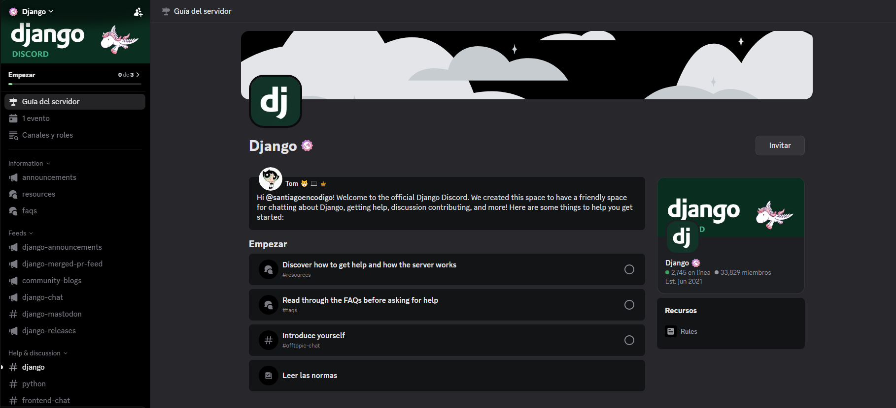

# Documentación django

A continuación mis apuntes de la clase del 17/07/2026. 

Sentí como si fuera una recapitulación de lo que hemos visto, y por otro lado django respecto a documentación debido a que el siguente trimestre vamos a desarrollar el documento final del proyecto formativo.

> Debemos verificar la documentación de nuestro proyecto para tener facil la elaboración de este documento final.

La instructora compartió los siguentes recursos:

[**https://www.djangoproject.com/**](https://www.djangoproject.com/ "https://www.djangoproject.com/")

"Django was designed to help developers take applications from concept to completion as quickly as possible." Me parece bastante agradable el cómo lo presentan, pues el framework efectivamente ayuda en temas de escalabilidad, seguridad y desarrollo rápido. La página es muy interesante porque contiene varias secciones y una UI de colores verdes, que juega con tonos oscuros y claros teniendo casi la esencia de un domino.

Como es de código abierto tiene su repositorio de GitHub, y tambien tiene un grupo de discord! Actualmente el grupo contiene 33.000 miembros. Y es bastante interesante porque ¿Uno qué podría hacer con este grupo? Debe haber muchas personas interesantes ahí.

* Me deja pensando un poco el tema de las donaciones pues, ¿Qué tanto dinero se logra recoger con esa sección?, ¿Cómo invertiran el dinero?, ¿Cómo será el flujo de trabajo?

* El apartado de documentación es bastante curioso al ver como la sección inicialmente habla sobre cómo esta organizada la documentación y lo muestra como estilo tabla de contenido y esta llena de puros links. Entonces pienso que... Alguien que sea experto en django, se habrá leido toda la [documentación de django](https://docs.djangoproject.com/en/6.0/ "https://docs.djangoproject.com/en/6.0/").

* Ingrese al grupo de discord y tiene apartados para ayudar y recibir ayuda respecto a código, para encontrar trabajo relacionado con este framework, para encontrar y organizar eventos, para contribuir en django y otros proyectos o simplemente para hablar.

> Realmente interesante. Un framework tiene una comunidad muy grande, ¿Te imaginas construyendo algo similar? Incluso pensando con que solo sea una persona la que quiera contribuir en un proyecto, ya ocupa tiempo leer sus cambios. Ahora, cuánto trabajo es mirar el cambio de 2.780 personas (contribuidores).

---

[**https://www.geeksforgeeks.org/python/django-tutorial/**](https://www.geeksforgeeks.org/python/django-tutorial/ "https://www.geeksforgeeks.org/python/django-tutorial/")

La instructora en su mayoria habló de este enlace. Explicando un poco más sobre lo que ya hemos estado haciendo en este trimestre, pero ya tomando de referencia esta documentación adaptada.

> No me gusto que en la página tuviera varios anuncios, incluso de uno de los actuales candidatos presidenciales. ¿Cómo será este tema por detras?

Además de explicar lo de django, tambien hay un apartado estilo paso a paso para desarrollar con el framework.

* [https://www.geeksforgeeks.org/python/e-commerce-website-using-django/](https://www.geeksforgeeks.org/python/e-commerce-website-using-django/ "https://www.geeksforgeeks.org/python/e-commerce-website-using-django/")

Me parecio muy agradable el cómo mostraban un diseño de entidades con el tipo de relación, tipos de datos y qué FK y PK habian, Modelo Relacional, Los casos de Uso y luego todo un paso a paso del cómo desarrollarlo.

*Imagen Tomada De: https://www.geeksforgeeks.org/python/e-commerce-website-using-django/*

---

Nos invito a plantearnos una pregunta: ¿Cómo codificamos? Esta basado en funciones o en clases?

Un buen lugar para mirar temas de sintaxis y enfocado hacia el lenguaje: [https://www.w3schools.com/django/](https://www.w3schools.com/django/ "https://www.w3schools.com/django/").

En esta página veremos temas como:

Templates Tags: Todo el tema de herencia en django para las vistas. En otras palabras el contenido que esta entre {{}} en django. Y muchas cosas más.

Ahorita lo que importa es que nuestro código funcioné. Estamos haciendo un código, puede que al ultimo día digamos que tocará re estructurar el código y revisar varias cosas. La razón es porque si un compañero presento otra solución y esta de mejor manera.

Este tema viene de a Funciones o Clases. ¿Qué está más facil?

* Cuando es por funciones, el proyecto no tiene tanto alcance y lo importante es tener un prototipo funcional.

* Cuando se hace por clases en las views, es para ahorrar tiempo y re utilizar código mediante la herencia.

> Hay que hacer un estudio autonomo serio.

> Tenemos 6 meses más para finalizar nuestro proyecto formativo.

* La instructora es consciente de que vamos a utilizar chatgpt, menciona lo importante del reflexionar por qué colocamos lo que colocamos en el código y hacer un analisis del código antes.

> "Discriminar lo que nos sugieren."

---

En el futuro vamos a mirar temas de django rest framework

* Se utilizará rest framework

* Se utilizará postman.

* Apis: Cuando uno conecta con otras aplicaciones.

> Es cierto que ya estamos mirando backend. Esto ya puede ser el uso de herramientas para un proyecto más completo.

Ahora esta empezando a ser más importante determinar como esta organizado nuestro código.

> La instructora va a empezar a revisar código cada jueves de ahora en adelante.

* En sustentación de proyectos a cualquiera se le puede preguntar por cualquier cosa, ya sea de documentación, código o el proyecto en si.

* Se pide que hagamos una reunion diaria de almenos 15 minutos para mirar el proyecto.
